Background methods
==================
I've called background methods those functions useful for drawing borders, lands, etc. to distinguish them from those aimed to draw user data.

arcgisimage
-----------
Downloads and plots an image using the `arcgis REST API service <http://server.arcgisonline.com/arcgis/rest/services>`_

`arcgisimage(server='http://server.arcgisonline.com/ArcGIS', service='ESRI_Imagery_World_2D', xpixels=400, ypixels=None, dpi=96, verbose=False, **kwargs) <http://matplotlib.org/basemap/api/basemap_api.html#mpl_toolkits.basemap.Basemap.arcgisimage>`_

* server can be used to connect to another server using the same REST API
* service is the layer to draw. To get the full list of available layers, check the `API web page <http://server.arcgisonline.com/arcgis/rest/services>`_, 
* xpixels actually sets the zoom of the image. A bigger number will ask a bigger image, so the image will have more detail. So when the zoom is bigger, the xsize must be bigger to maintain the resolution
* ypixels can be used to force the image to have a different number of pixels in the y direction that the ones defined with the aspect ratio. By default, the aspect ratio is maintained, which seems a good value
* dpi is the image resolution at the output device. Changing its value will change the number of pixels, but not the zoom level 
* verbose prints the url used to get the remote image. It's interesting for debugging

An important point when using this method is that the projection must be set using the *epsg* argument, unless 4326, or *cyl* in *Basemap notation* is used. To see how to set a projection this way, see the section :ref:`epsg`

.. literalinclude:: ../code_examples/backgrounds/arcgisimage.py

The example shows Menorca island using the UTM projection at the zone 31N, and can be used with many layers:

The default *ESRI_Imagery_World_2D* layer

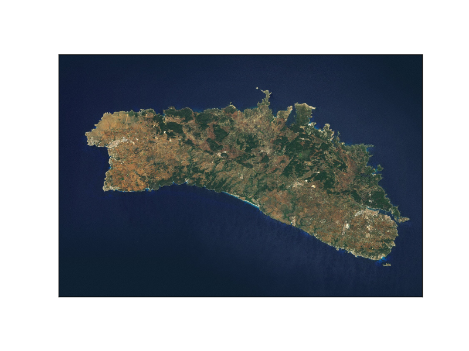

The *World_Shaded_Relief* layer

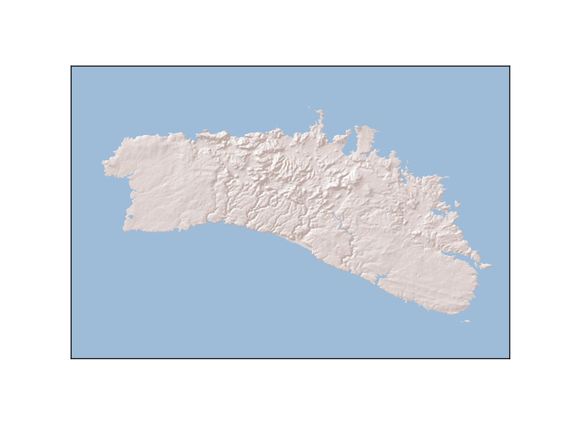

bluemarble
----------
Plots the `bluemarble image <http://visibleearth.nasa.gov/>`_ on the map.

`bluemarble(ax=None, scale=None, **kwargs) <http://matplotlib.org/basemap/api/basemap_api.html#mpl_toolkits.basemap.Basemap.bluemarble>`_

* The scale is useful to downgrade the original image resolution to speed up the process. A value of 0.5 will divide the size of the image by 4
* The image is warped to the final projection, so all projections work properly with this method

.. literalinclude:: ../code_examples/backgrounds/bluemarble.py

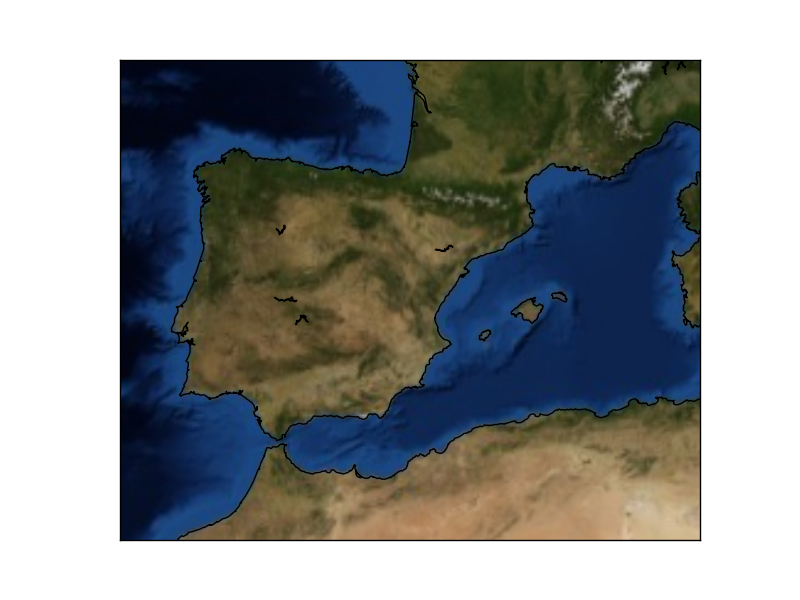

drawcoastlines
--------------
Draws the coastlines.

The function has the following arguments:

`drawcoastlines(linewidth=1.0, linestyle='solid', color='k', antialiased=1, ax=None, zorder=None) <http://matplotlib.org/basemap/api/basemap_api.html#mpl_toolkits.basemap.Basemap.drawcoastlines>`_

* linewidth sets, of course, the line width in pixels
* linestyle sets the line type. By default is solid, but can be dashed, or any matplotlib option
* color is k (black) by default. Follows also matplotlib conventions
* antialiased is true by default
* zorder sets the layer position. By default, the order is set by Basemap

.. literalinclude:: ../code_examples/first_map/first_map.py

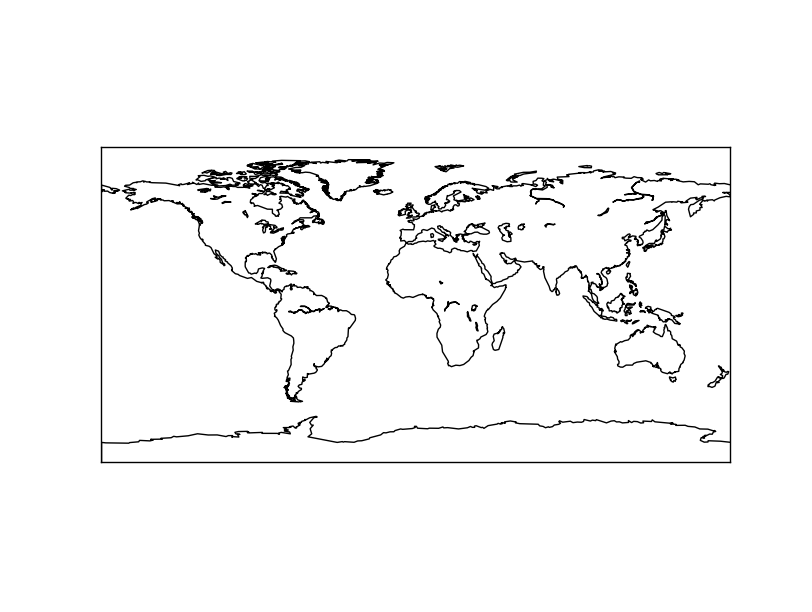

drawcounties
------------
Draws the USA counties from the layer included with the library

`drawcounties(linewidth=0.1, linestyle='solid', color='k', antialiased=1, facecolor='none', ax=None, zorder=None, drawbounds=False) <http://matplotlib.org/basemap/api/basemap_api.html#mpl_toolkits.basemap.Basemap.drawcounties>`_

* linewidth sets, of course, the line width in pixels
* linestyle sets the line type. By default is solid, but can be dashed, or any matplotlib option
* color is k (black) by default. Follows also matplotlib conventions
* antialiased is true by default
* zorder sets the layer position. By default, the order is set by Basemap

.. note:: facecolor argument, which is supposed to color the counties, doesn't seem to work at least in some Basemap versions.

Note that:

* The resolution is fix, and doesn't depend on the resolution parameter passed to the class constructor
* The coastline is in another function, and the country coasts are not considered coast, which makes necessary to combine the method with others to get a good map

.. literalinclude:: ../code_examples/backgrounds/drawcounties.py
	:emphasize-lines: 10
	
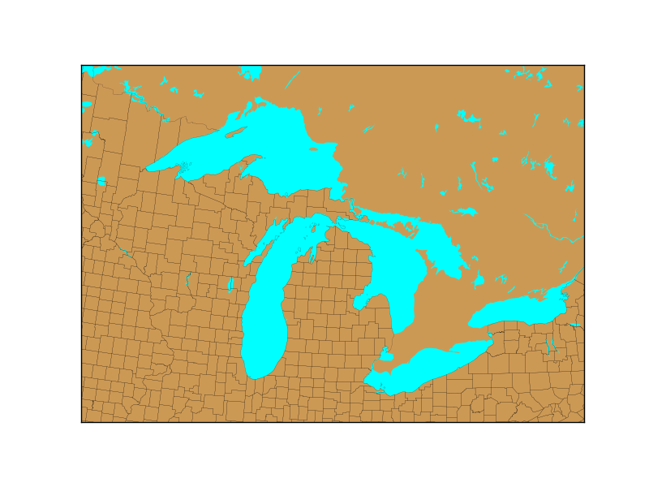

drawcountries
--------------
Draws the country borders from the layer included with the library.

The function has the following arguments:

`drawcountries(linewidth=1.0, linestyle='solid', color='k', antialiased=1, ax=None, zorder=None) <http://matplotlib.org/basemap/api/basemap_api.html#mpl_toolkits.basemap.Basemap.drawcoastlines>`_

* linewidth sets, of course, the line width in pixels
* linestyle sets the line type. By default is solid, but can be dashed, or any matplotlib option
* color is k (black) by default. Follows also matplotlib conventions
* antialiased is true by default
* zorder sets the layer position. By default, the order is set by Basemap

Note that:

* The resolution indicated when creating the :ref:`basemap` instance makes the layer to have a better or coarser resolution
* The coastline is in another function, and the country coasts are not considered coast, which makes necessary to combine the method with others to get a good map

.. literalinclude:: ../code_examples/backgrounds/drawcountries.py
	:emphasize-lines: 10
	
.. image:: images/backgrounds/drawcountries.png

Without drawing the coastline, the result is a bit strange:

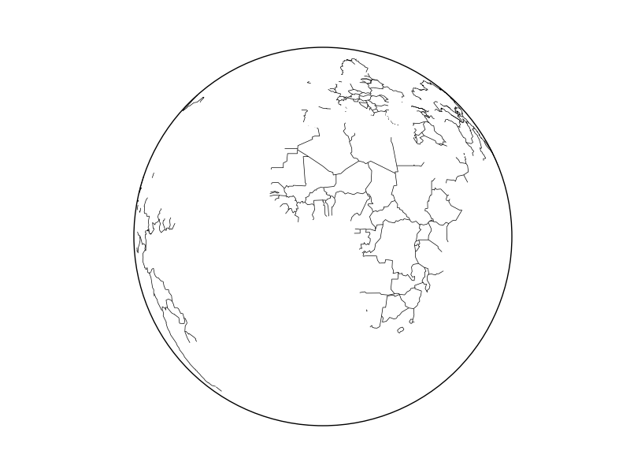

drawlsmask
----------
A method that draws at once lakes, land and oceans. Avoids *fillcontinents* and *drawmapboundary*. Besides, it can change the data origin to a custom array of points.

A difference from the other methods is that the zorder can't be set in this method.

`drawlsmask(land_color='0.8', ocean_color='w', lsmask=None, lsmask_lons=None, lsmask_lats=None, lakes=True, resolution='l', grid=5, **kwargs) <http://matplotlib.org/basemap/api/basemap_api.html#mpl_toolkits.basemap.Basemap.drawlsmask>`_

* land_color sets the color assigned to the land (a gray by default)
* ocean_color sets the colors of the oceans (white by default)
* lsmask An array with alternative data. If None, the default data from the library is taken. The array must contain 0's for oceans and 1's for land
* lsmask_lons the longitudes for the alternative land sea mask
* lsmask_lats the latitudes for the alternative land sea mask
* resolution can change the resolution of the data defined by the Basemap instance
* grid The mask array grid resolution in minutes of arc. Default is 5 minutes

.. literalinclude:: ../code_examples/backgrounds/drawlsmask.py

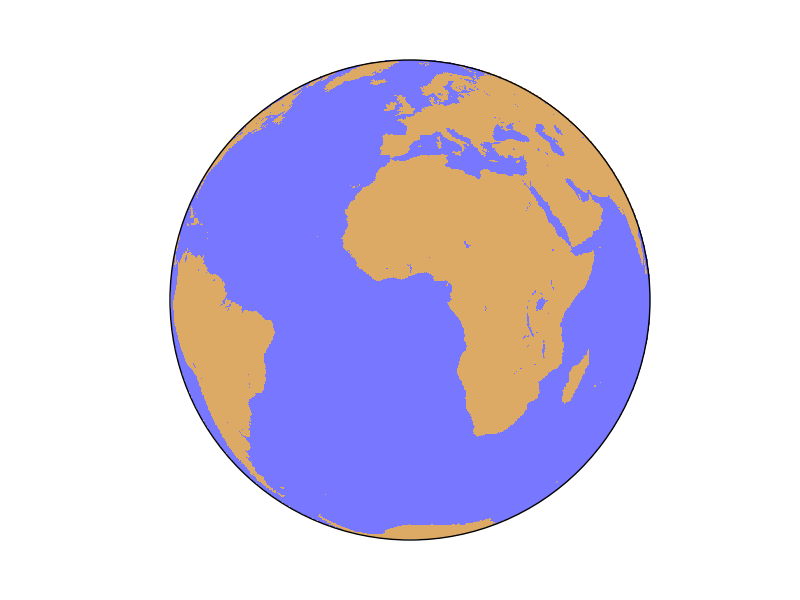

drawmapboundary
---------------
Draws the earth boundary on the map, with optional filling.

`drawmapboundary(color='k', linewidth=1.0, fill_color=None, zorder=None, ax=None) <http://matplotlib.org/basemap/api/basemap_api.html#mpl_toolkits.basemap.Basemap.drawmapboundary>`_

* linewidth sets, of course, the line width in pixels
* color sets the edge color and is k (black) by default. Follows also matplotlib conventions
* fill_color sets the color that fills the globe, and is None by default . Follows also matplotlib conventions
* zorder sets the layer position. By default, the order is set by Basemap

.. literalinclude:: ../code_examples/backgrounds/drawmapboundary.py

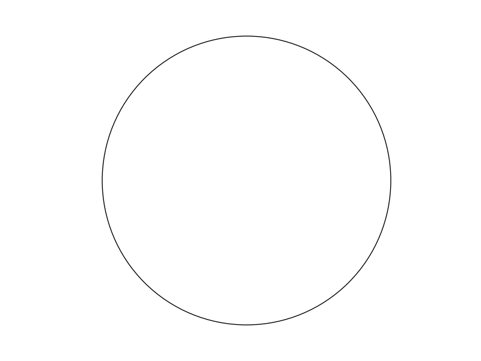

    Orthographic projection result

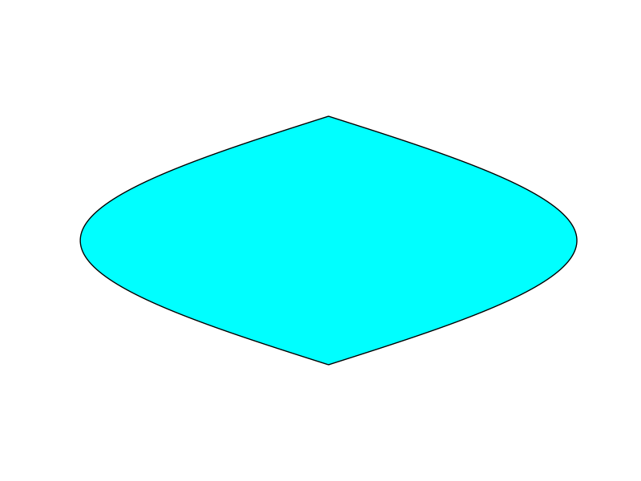

    Sinusoidal Projection result

.. _drawmeridians:

drawmeridians
-------------
Draws the meridians on the map

`drawmeridians(meridians, color='k', linewidth=1.0, zorder=None, dashes=[1, 1], labels=[0, 0, 0, 0], labelstyle=None, fmt='%g', xoffset=None, yoffset=None, ax=None, latmax=None, **kwargs) <http://matplotlib.org/basemap/api/basemap_api.html#mpl_toolkits.basemap.Basemap.drawmeridians>`_

* meridians is a list with the longitudes to plot. This can be created with *range()* if the values are integers. If you need floats, *np.arange()* is a good option
* color sets the color of the line. `This page explains all the color options <http://matplotlib.org/api/colors_api.html>`_
* linewidth sets, of course, the line width in pixels
* zorder changes the position of the lines, to be able, for instance, to make the land to cover the meridians, or the opposite
* Sets the dashing style. The first element is the number of pixels to draw, and the second, the number of pixels to skip
* labels change the positions where the labels are drawn. Setting the value to 1 makes the labels to be drawn at the selected edge of the map. The four positions are [left, right, top, bottom]

.. literalinclude:: ../code_examples/backgrounds/draw_meridians.py

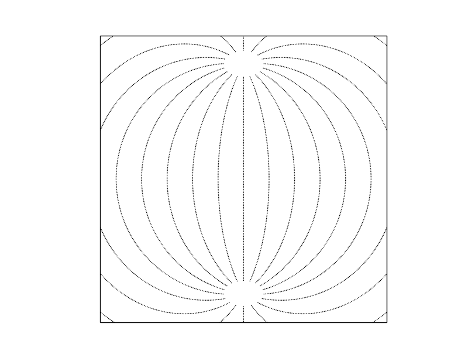

This example shows the simplest way to use the function, using the Azimuthal equidistant projection. To see a more complex example, take a look at :ref:`drawparallels`

.. _drawparallels:

drawparallels
-------------
Draws the parallels on the map

`drawparallels(circles, color='k', linewidth=1.0, zorder=None, dashes=[1, 1], labels=[0, 0, 0, 0], labelstyle=None, fmt='%g', xoffset=None, yoffset=None, ax=None, latmax=None, **kwargs) <http://matplotlib.org/basemap/api/basemap_api.html#mpl_toolkits.basemap.Basemap.drawparallels>`_

* parallels is a list with the longitudes to plot. This can be created with *range()* if the values are integers. If you need floats, *np.arange()* is a good option
* color sets the color of the line. `This page explains all the color options <http://matplotlib.org/api/colors_api.html>`_
* linewidth sets, of course, the line width in pixels
* zorder changes the position of the lines, to be able, for instance, to make the land to cover the parallels, or the opposite
* Sets the dashing style. The first element is the number of pixels to draw, and the second, the number of pixels to skip
* labels change the positions where the labels are drawn. Setting the value to 1 makes the labels to be drawn at the selected edge of the map. The four positions are [left, right, top, bottom]

.. literalinclude:: ../code_examples/backgrounds/draw_parallels.py

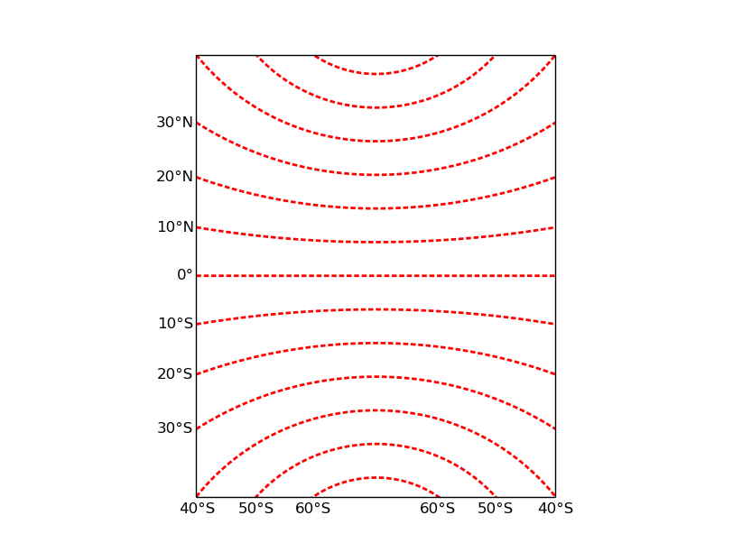

The example shows some avance functions, such as labeling or zorder, using the `polyconic projection <http://matplotlib.org/basemap/users/poly.html>`_. To see a simpler example, take a look ar :ref:`drawmeridians`

drawrivers
----------
Draws the rivers from the layer included with the library. 

`drawrivers(linewidth=0.5, linestyle='solid', color='k', antialiased=1, ax=None, zorder=None) <http://matplotlib.org/basemap/api/basemap_api.html#mpl_toolkits.basemap.Basemap.drawrivers>`_

* linewidth sets, of course, the line width in pixels
* linestyle sets the line type. By default is solid, but can be dashed, or any matplotlib option
* color is k (black) by default. Follows also matplotlib conventions
* antialiased is true by default
* zorder sets the layer position. By default, the order is set by Basemap

Note that:

* The resolution is fix, and doesn't depend on the resolution parameter passed to the class constructor

.. literalinclude:: ../code_examples/backgrounds/drawrivers.py
	:emphasize-lines: 14
	
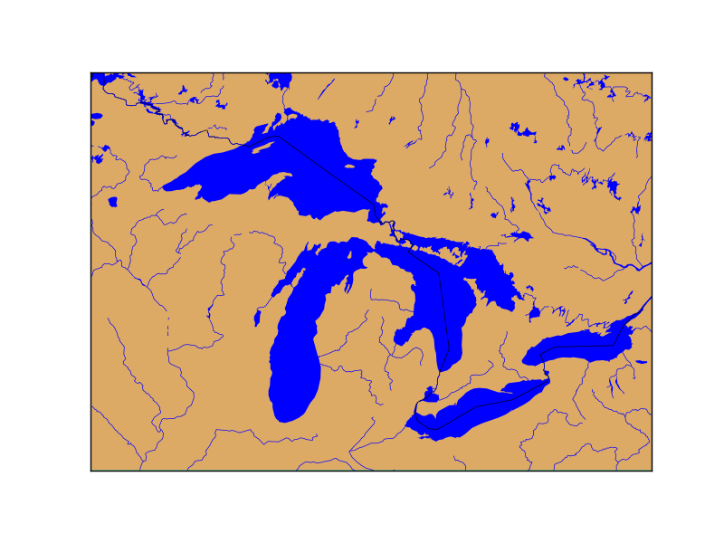

drawstates
----------
Draws the American countries states borders from the layer included with the library. Draws also the Australian states.

`drawstates(linewidth=0.5, linestyle='solid', color='k', antialiased=1, ax=None, zorder=None) <http://matplotlib.org/basemap/api/basemap_api.html#mpl_toolkits.basemap.Basemap.drawstates>`_

* linewidth sets, of course, the line width in pixels
* linestyle sets the line type. By default is solid, but can be dashed, or any matplotlib option
* color is k (black) by default. Follows also matplotlib conventions
* antialiased is true by default
* zorder sets the layer position. By default, the order is set by Basemap

Note that:

* The resolution is fix, and doesn't depend on the resolution parameter passed to the class constructor
* The country border is not drawn, creating a strange effect if the method is not combined with drawcountries

.. literalinclude:: ../code_examples/backgrounds/drawstates.py
	:emphasize-lines: 14
	
.. image:: images/backgrounds/drawstates.png

etopo
-----
Plots a relief image called *etopo* taken from the `NOAA <http://www.ngdc.noaa.gov/mgg/global/global.html>`_. The image has a 1'' arch resolution, so when zooming in, the results are quite poor.

`etopo(ax=None, scale=None, **kwargs) <http://matplotlib.org/basemap/api/basemap_api.html#mpl_toolkits.basemap.Basemap.etopo>`_

* The scale is useful to downgrade the original image resolution to speed up the process. A value of 0.5 will divide the size of the image by 4
* The image is warped to the final projection, so all projectinos work properly with this method

.. literalinclude:: ../code_examples/backgrounds/etopo.py

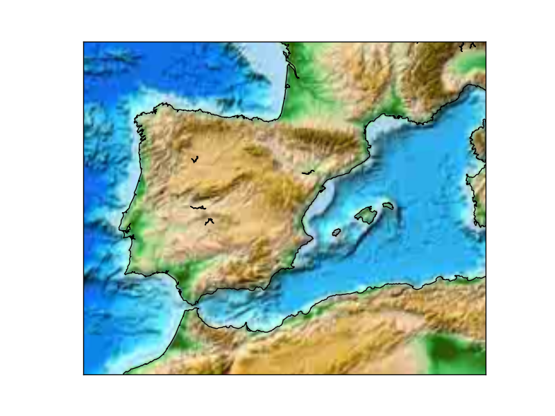

.. _fillcontinents:

fillcontinents
--------------
Draws filled polygons with the continents

`fillcontinents(color='0.8', lake_color=None, ax=None, zorder=None, alpha=None) <http://matplotlib.org/basemap/api/basemap_api.html#mpl_toolkits.basemap.Basemap.fillcontinents>`_

* color sets the continent color. By default is a gry color. `This page explains all the color options <http://matplotlib.org/api/colors_api.html>`_
* lake color sets the color of the lakes. By default doesn't draw them, but you may set it to aqua to plot them blue
* alpha is a value from 0 to 1 to set the transparency
* zorder sets the position of the layer related to others. It can be used to hide (or show) a contourf layer, that should be only on the sea, for instance

.. literalinclude:: ../code_examples/first_map/first_map_fill.py
	:emphasize-lines: 10

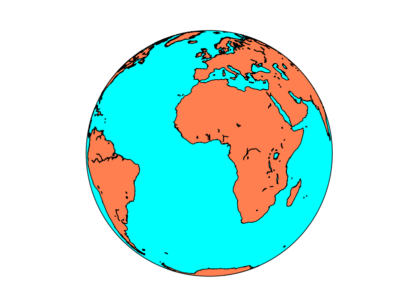

shadedrelief
------------
Plots a shaded relief image. The origin is the www-shadedrelief.com web page. The original image size is 10800x5400

`shadedrelief(ax=None, scale=None, **kwargs) <http://matplotlib.org/basemap/api/basemap_api.html#mpl_toolkits.basemap.Basemap.shadedrelief>`_

* The scale is useful to downgrade the original image resolution to speed up the process. A value of 0.5 will divide the size of the image by 4. The original size is quite big, 10800x5400 pixels
* The image is warped to the final projection, so all projections work properly with this method

.. literalinclude:: ../code_examples/backgrounds/shadedrelief.py

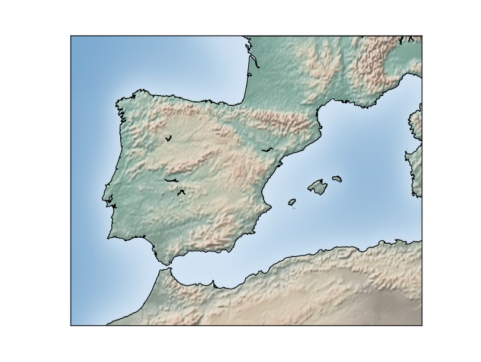

warpimage
---------

Displays an image as a background. 

`warpimage(image='bluemarble', scale=None, **kwargs) <http://matplotlib.org/basemap/api/basemap_api.html#mpl_toolkits.basemap.Basemap.warpimage>`_

* By default, displays the NASA Bluemarble image
* The image must be in latlon projection, so the x size must be double than the y size
* The image must cover the whole world, with the longitude starting at -180

.. literalinclude:: ../code_examples/backgrounds/warpimage.py

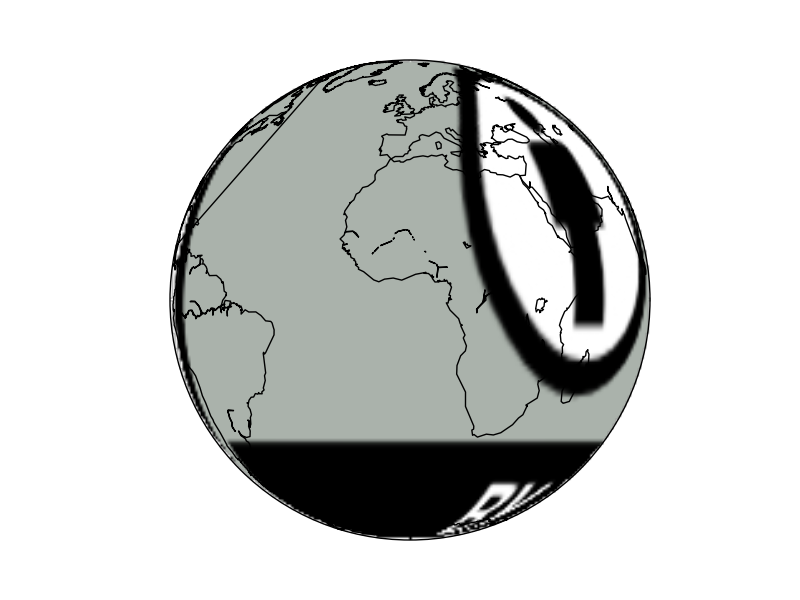

* The image must be resized to fit the proportions. The script won't work if the computer hasn't got the /tmp directory. 

wmsimage
--------
Downloads and plots an image, using the `WMS protocol <http://en.wikipedia.org/wiki/Web_Map_Service>`_

`wmsimage(server, xpixels=400, ypixels=None, format='png', verbose=False, **kwargs) <http://matplotlib.org/basemap/api/basemap_api.html#mpl_toolkits.basemap.Basemap.wmsimage>`_

.. note:: Many arguments aren't documented, making this method a little bit difficult to use

* server can be used to connect to another server using the same REST API
* xpixels actually sets the zoom of the image. A bigger number will ask a bigger image, so the image will have more detail. So when the zoom is bigger, the xsize must be bigger to maintain the resolution
* ypixels can be used to force the image to have a different number of pixels in the y direction that the ones defined with the aspect ratio. By default, the aspect ratio is maintained, which seems a good value
* format sets the image format to ask at the WMS server. Usually, the possibilities are png/gif/jpeg. 
* verbose prints the url used to get the remote image. It's interesting for debugging, since prints all the available layers, projections in EPSG codes, and other information

The problem is that using only these parameters won't add the layer properly. There are more mandatory arguments:

* layers is a list of the WMS layers to use. To get all the possible layers, take a look at the WMS GetCapabilities or, easier, use verbose=True to print them
	* When the layer name has a space, the method won't work or, at least, I couldn't make it work. Unfortunately, many services offer layers with spaces in its name 
* styles is a list with the styles to ask to the WMS service for the layers. Usually will work without this parameter, since the server has usually default styles
* Other parameters, such as date, elevation or colorscale have the same names and do the same things as in the WMS standard

* An other important point when using this method is that the projection must be set using the *epsg* argument, unless 4326, or *cyl* in *Basemap notation* is used. To see how to set a projection this way, see the section :ref:`epsg`

.. note:: The method requires `OWSLib <https://pypi.python.org/pypi/OWSLib>`_. To install it, just type *sudo pip install OWSLib*

The `Basemap test files <https://github.com/matplotlib/basemap/blob/master/examples/testwmsimage.py>`_ shows how to use the method quite well.  

.. literalinclude:: ../code_examples/backgrounds/wmsimage.py

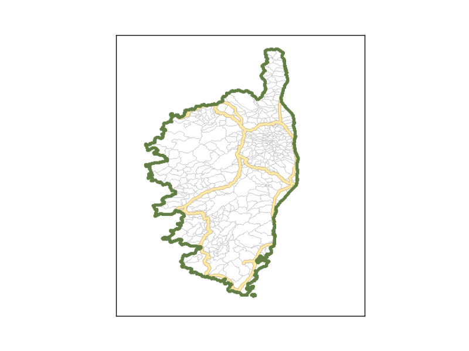

The source of the map data is http://www.geosignal.org, which has many layers for France.
