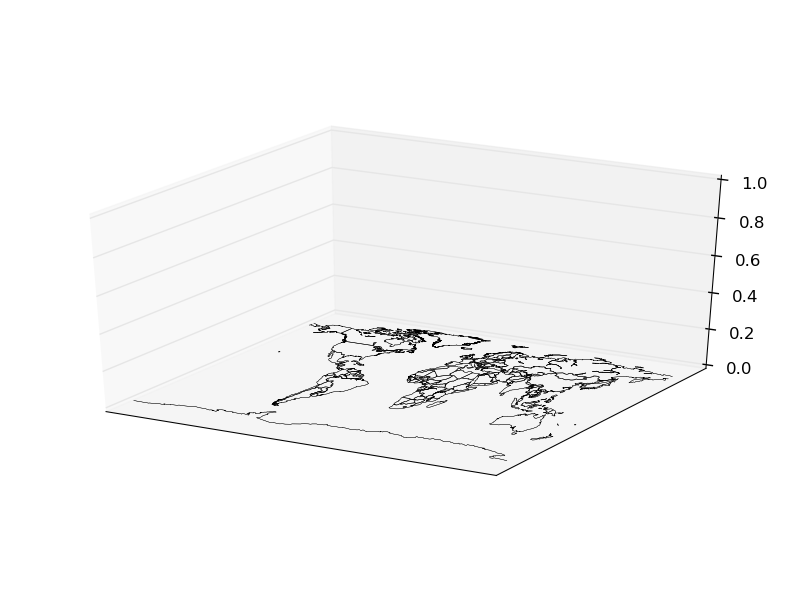
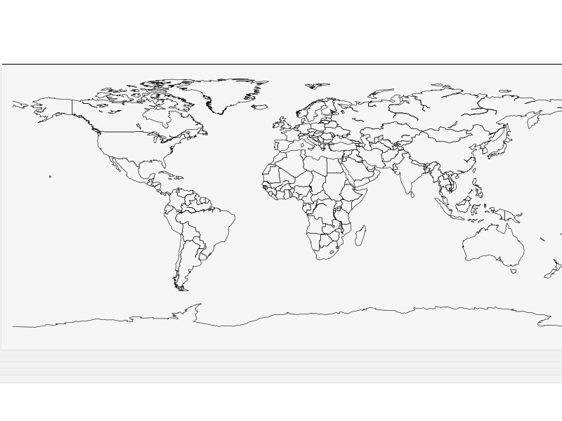

Basemap in 3D
=============

Even though many people don't like them, maps with 3d elements can be created using basemap and the `matplotlib mplot3d <http://matplotlib.org/mpl_toolkits/mplot3d/>`_ toolkit.

Creating a basic map
--------------------

The most important thing to know when starting with 3d matplotlib plots is that the *Axes3D* class has to be used. 
To add geographical data to the map, the method *add_collection3d* will be used:

.. literalinclude:: ../code_examples/cookbook/plotting_3d_basic.py 

* The ax variable is in this example, an Axes3D instance. All the methods will be used from this instance, so they need to support 3D operations, which doesn't occur in many cases on the basemap methods
* The commented block shows how to rotate the resulting map so the view is better
* To draw lines, just use the add_collection3d method with the output of any of the basemap methods that return an matplotlib.patches.LineCollection object, such as drawcountries

    Basic usage, the axis rotation is the one by default

    The axis rotation is set so the map is watched from the z axis, like when drawing it in 2D

Filling the polygons
--------------------

Unfortunately, the basemap :ref:`fillcontinents` method doesn't return an object supported by `add_collection3d <http://matplotlib.org/mpl_toolkits/mplot3d/api.html#mpl_toolkits.mplot3d.axes3d.Axes3D.add_collection3d>`_ (PolyCollection, LineColleciton, PatchCollection), but a list of `matplotlib.patches.Polygon <http://matplotlib.org/api/patches_api.html#matplotlib.patches.Polygon>`_ objects.

The solution, of course, is to create a list of PolyCollection:

.. literalinclude:: ../code_examples/cookbook/plotting_3d_fill.py 

* The coast lines and the countries are drawn as in the previous example
* To create the PolyCollection, the polygons are needed, but the :ref:`basemap` object has it in the field landpolygons. (There are others for the rest of the included polygons, such as the countries)
* For each of the polygons, the coordinates can be retrieved as a list of floats using the get_coords method. (he are _geoslib.Polygon objects)
* Once a list of coordinates list is created, the PoilyCollection can be built
* The PolyCollection is added using add_collection3d, as we did with the lines
* If the original polygons are added using fillcontinents, matplotlib says that doesn't has the methods to convert it to 3D

.. note: If the coast lines aren't drawn, the filled continents don't get drawn, which is quite weird. So it's necessary to use drawcoastlines.

.. image:: images/cookbook/plotting_3d_fill.png

Adding 3D bars
--------------

Creating a 3D map hasn't got sense if no 3D data is drawn on it. The `Axes3D class <http://matplotlib.org/mpl_toolkits/mplot3d/api.html>`_ has the bar3d method that draws 3D bars. It can be added on the map using the 3rd dimension:

.. literalinclude:: ../code_examples/cookbook/plotting_3d_bars.py 

* The map is zoomed to fit the needs of the Ebola cases dataset
* The axes are eliminated with the method set_axis_off
* The bar3d needs the x, y and z positions, plus the delta x, y and z. To be properly drawn, the z position must be 0, and the delta z, the final value

.. image:: images/cookbook/plotting_3d_bars.png
