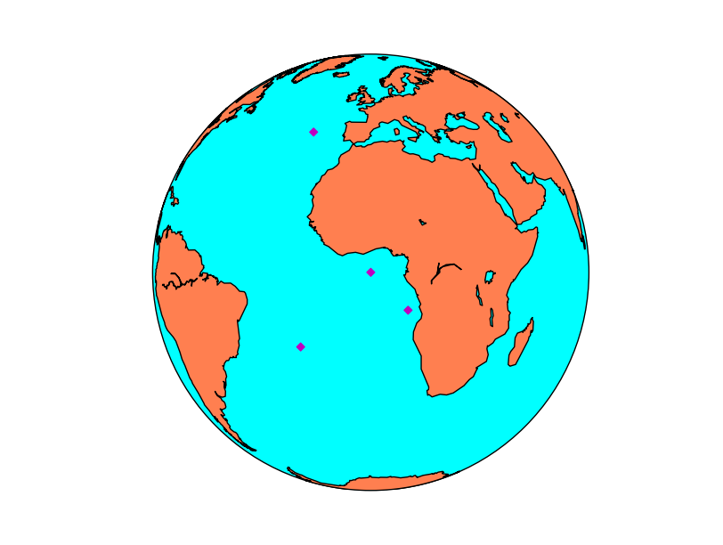
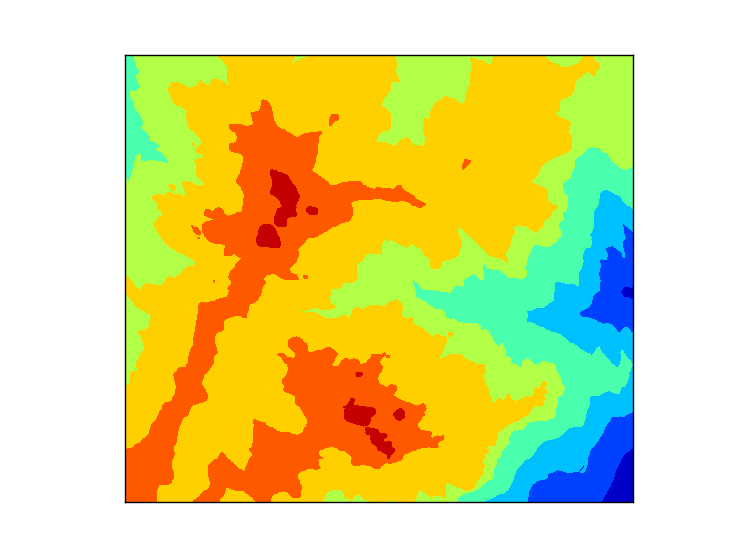
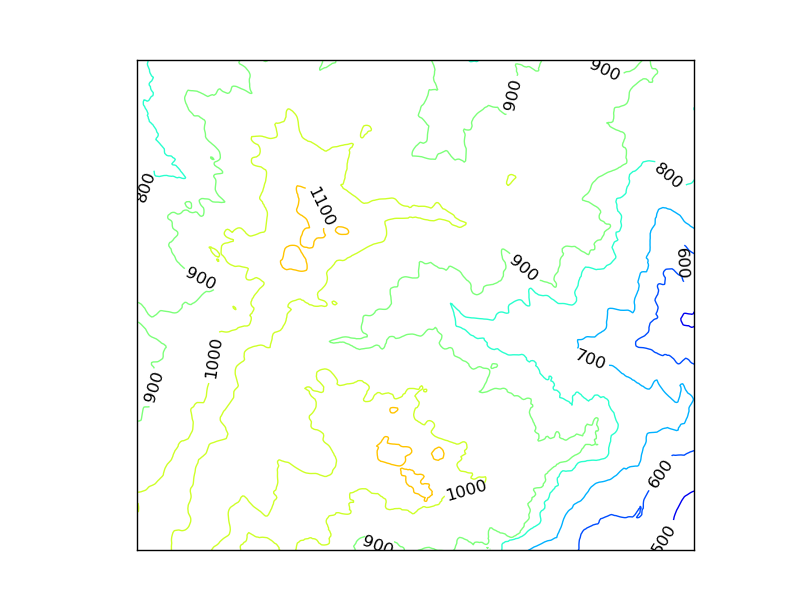
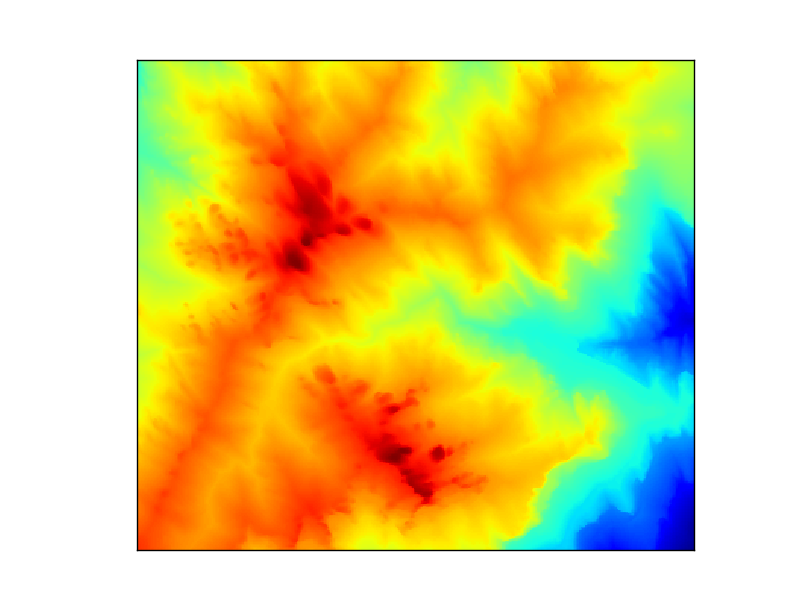

Basic functions
===============
Drawing a point in a map
------------------------
Drawing a point in a map is usually done using the `plot method <http://matplotlib.org/basemap/api/basemap_api.html#mpl_toolkits.basemap.Basemap.plot>`_:

.. literalinclude:: ../code_examples/basic_functions/point.py
	:emphasize-lines: 11-13

* Use the Basemap instance to calculate the position of the point in the map coordinates when you have the longitude and latitude of the point
	* If latlon keyword is set to True, x,y are interpreted as longitude and latitude in degrees. Won't work in old *basemap* versions
* The *plot* method needs the x and y position in the map coordinates, the marker and the color
	* By default, the marker is a point. `This page explains all the options <http://matplotlib.org/api/markers_api.html>`_
	* By default, the color is black (k). `This page explains all the color options <http://matplotlib.org/api/colors_api.html>`_
	
If you have more than one point, you may prefer the `scatter method <http://matplotlib.org/basemap/api/basemap_api.html#mpl_toolkits.basemap.Basemap.scatter>`_. Passing an array of point into the plot method creates a line connecting them, which may be interesting, but is not a point cloud:

.. literalinclude:: ../code_examples/basic_functions/scatter.py
	:emphasize-lines: 11-16

* Remember that calling the *Basemap* instance can be done with lists, so the coordinate transformation is done at once
* The format options in the *scatter* method are the same as in plot

Plotting raster data
--------------------
There are two main methods for plotting a raster, *contour/contourf*, that plots contour lines or filled contour lines (isobands) and *pcolor/pcolormesh*, that creates a pseudo-color plot.

.. _basic_contourf:

contourf
^^^^^^^^
.. literalinclude:: ../code_examples/basic_functions/contourf.py
	

* The map is created with the same extension of the raster file, to make things easier.
* Before plotting the contour, two matrices have to be created, containing the positions of the x and y coordinates for each point in the data matrix.
	* `linspace <http://docs.scipy.org/doc/numpy/reference/generated/numpy.linspace.html>`_ is a numpy function that creates an array from an initial value to an end value with n elements. In this case, the map coordinates go from 0 to *map.urcrnrx* or *map.urcrnry*, and have the same size that the data array *data.shape[1]* and *data.shape[0]*
	* `meshgrid <http://docs.scipy.org/doc/numpy/reference/generated/numpy.meshgrid.html>`_ is a numpy function that take two arrays and create a matrix with them. This is what we need, since the *x* coordinates repeat in every column, and the *y* in every line
* The contourf method will take the *x*, *y* and *data* matrices and plot them in the default *colormap*, called jet, and an automatic number of levels
* The number of levels can be defined after the data array, as you can see at the section :ref:`basic_contour`. This can be done in two ways
	* An integer indicating the number of levels. The extreme values of the data array will indicate the extremes of the color scale
	* A list with the values for each level. The range function is useful to set them i.e. range(0, 3000, 100) to set a level each 100 units

.. _basic_contour:

contour  
^^^^^^^
.. literalinclude:: ../code_examples/basic_functions/contour.py
	:emphasize-lines: 22-24
	

* The data must be prepared as in the :ref:`basic_contourf` case
* The levels are set using the range function. We are dealing with altitude, so from 400 m to 1400 m , a contour line is created each 100 m
* The colormap is not the default jet. This is done by passing to the cmap argument the `cubehelix colormap <http://www.ifweassume.com/2014/04/cubehelix-colormap-for-python.html>`_
* The labels can be set to the contour method (but not to contourf)
	* inline makes the contour line under the line to be removed
	* fmt formats the number
	* fontsize sets the size of the label font
	* colors sets the color of the label. By default, is the same as the contour line
	
pcolormesh
^^^^^^^^^^
.. literalinclude:: ../code_examples/basic_functions/pcolormesh.py
	

* The data must be prepared as in the :ref:`basic_contourf` case
* The colormap can be changed as in the :ref:`basic_contour` example

.. note:: pcolor and pcolormesh are very similar. You can see a good explanation `here <http://thomas-cokelaer.info/blog/2014/05/matplotlib-difference-between-pcolor-pcolormesh-and-imshow/>`_

Calculating the position of a point on the map
----------------------------------------------
.. code-block:: python

	from mpl_toolkits.basemap import Basemap
	import matplotlib.pyplot as plt
	
	map = Basemap(projection='aeqd', lon_0 = 10, lat_0 = 50)
	
	print map(10, 50)
	print map(20015077.3712, 20015077.3712, inverse=True)

The output will be:
	
	(20015077.3712, 20015077.3712)
	(10.000000000000002, 50.000000000000014)
	
When inverse is False, the input is a point in longitude and latitude, and the output is the point in the map coordinates. When inverse is True, the behavior is the opposite.
	 