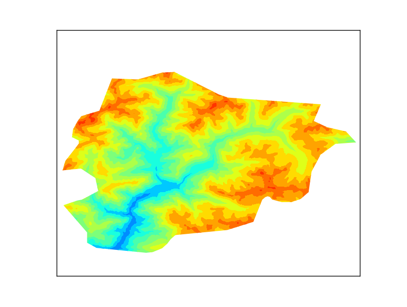

Clipping a raster with a shapefile
===================================
Getting some data
-----------------
The example plots some elevation data, taken from the SRTM. After looking for some options, the easiest to work with was this one: http://srtm.csi.cgiar.org/SELECTION/inputCoord.asp or download the file directly: http://srtm.csi.cgiar.org/SRT-ZIP/SRTM_V41/SRTM_Data_GeoTiff/srtm_37_04.zip

The shapefile will be the border of Andorra, taken from Natural Earth

The result is a little poor because the resolution is low, but works well for the example.

The code
--------
The example script uses `pyshp <http://code.google.com/p/pyshp/>`_ for reading the shapefile. Of course, `ogr <http://pcjericks.github.io/py-gdalogr-cookbook/>`_ could be used too, but not `fiona <http://toblerity.org/fiona/manual.html>`_, since fails when used with gdal in the same script.

.. literalinclude:: ../code_examples/clip/clip.py
    :emphasize-lines: 14-27, 48-49

Let's see each part:

Reading the shapefile and clipping
^^^^^^^^^^^^^^^^^^^^^^^^^^^^^^^^^^
To clip the image, a `Basemap path <http://matplotlib.org/users/path_tutorial.html>`_ is needed. The hightlighted lines in the code are the ones that do the job.

* A Matplotlib path is made by two arrays. One with the points (called vertices in the script), and the other with the functions for every point (called codes).
* In our case, only straight lines have to be used, so there will be a MOVETO to indicate the beginning of the polygon, many LINETO to create the segments and one CLOSEPOLY for closing it
* Of course, only the polygon for Andorra has to be used. I get it from the shapefile attributes
* The prt array is for managing multipolygons, which is not the case, but the code will create correct clipping for multipolygons
* The path is created using the Path function, and then added to a PathPatch, to be able to use it as a closed polygon. Note the trasnform=ax.transData attribute. This assumes the polygon coordinates to be the ones used in the data (longitudes and latitudes in our case). More information here
* The clipping itself is made in the lines 48 and 49. For each drawn element, the method set_clip_path is applied, which erases all the parts outside the clipping object

Drawing the map
^^^^^^^^^^^^^^^
The map is drawn as usual. I have used a latlon projection, so all the values for the raster and shapefile can be used directly. If the output raster was in an other projection, the shapefile coordinates should be appended to the path using the output projection (*m(pts[j][0], pts[j][1])*).

The x and y coordinates are calculated from the GDAL geotransform, and then turned into a matrix using meshgrid