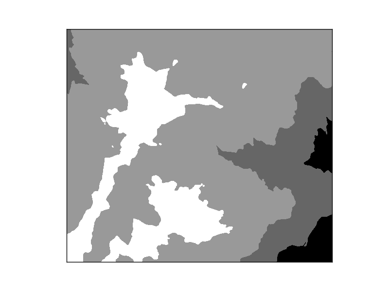
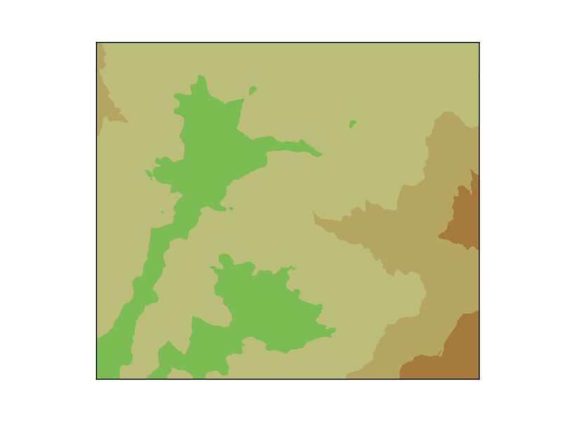
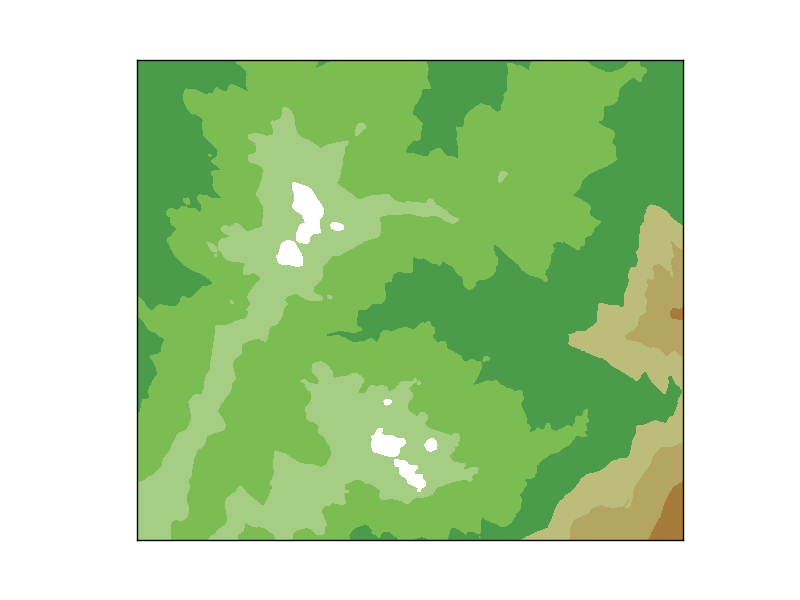

Custom colormaps
----------------

Matplotlib color maps are `really powerful <http://matplotlib.org/api/colors_api.html#matplotlib.colors.Colormap>`_, much more than the usual possibilities in other softwares. But they are quite difficult to understand, and most of the times, a simple list with intervals and colors is easier to work with:

.. literalinclude:: ../code_examples/cookbook/cmap.py
	:emphasize-lines: 8, 25

* The way to create the contourf plot is taken from the :ref:`contourf` example
* The color map is created using the `LinearSegmentedColormap.from_list <http://matplotlib.org/api/colors_api.html#matplotlib.colors.LinearSegmentedColormap.from_list>`_ static method. This method has the following arguments:
	1. The name given to the color map
	2. The color list. This is a list or sequence, each element containing three floats in the range 0 to 1, which are the red, green and blue values of the color
	3. N is the number of color levels to create. If the number is lower than the list of colors length, the list will be truncated If it's longer, some colors will be repeated
* In our example, the values will go from black to white, in six levels
* The contourf is created forcing a level in each of the elements of the sequence

GDAL includes an utility named gdaldem, that classifies a raster using the values defined in a file. The file format is originally used by the `GRASS r.colors <http://grass.osgeo.org/grass64/manuals/r.colors.html>`_ function. I like the format, since is really easy to understand and can be used from different software. Here's how to read it and use it with basemap:

.. literalinclude:: ../code_examples/cookbook/colortable.py

* The function read_color_table opens and reads the color file, and returns the levels defined in the file, and a color map that has its color
	* Checks if some line is commented
	* The original values are in the range 0-255, and have to be converted to 0-1
	* The color map is created using the `LinearSegmentedColormap.from_list <http://matplotlib.org/api/colors_api.html#matplotlib.colors.LinearSegmentedColormap.from_list>`_ static method
	* The function returns the levels and the color map so they can be used together or separately
* contourf is used with the values defined in the file

    The result if the levels are passed as an argument. Not all the colors are used, since some of them are defined out of the data range

    The result if the levels are not passed as an argument. The contourf method creates as many levels as number of colors of the cmap within the data values range
