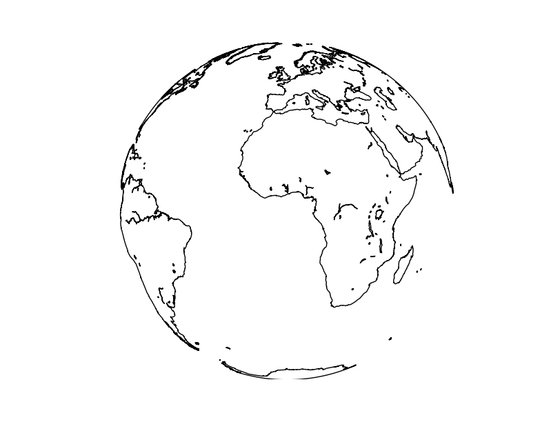

Drawing the first map
=======================
Let's create a the simplest map:

.. literalinclude:: ../code_examples/first_map.py

#. The first two lines include the Basemap library and matplotlib. Both are necessary
#. The map is created using the Basemap class, which has many options. In this example, we use the `Orthographic projection <http://en.wikipedia.org/wiki/Orthographic_projection_in_cartography>`_ centered at longitude 0 and latitude 0.
#. After setting the map, we can draw what we want. In this case, the coast lines layer, which comes already with the library, using the method *drawcoastlines()*
#. Finally, the map has to be shown or saved. The methods from mathplotlib are used. In this example, *plt.show()* opens a window to explore the result

The map is still a bit poor, so let's fill the oceans and continents with some colors. The methods *fillcontinents()* and *drawmapboundary()* will do it: 

.. literalinclude:: ../code_examples/first_map_fill.py
	:emphasize-lines: 7-10
.. image:: images/first_map_fill.png
