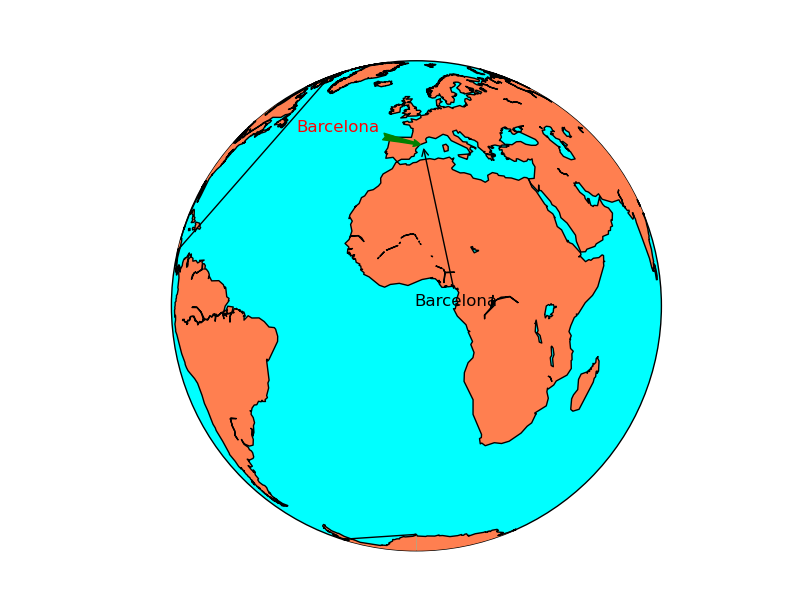
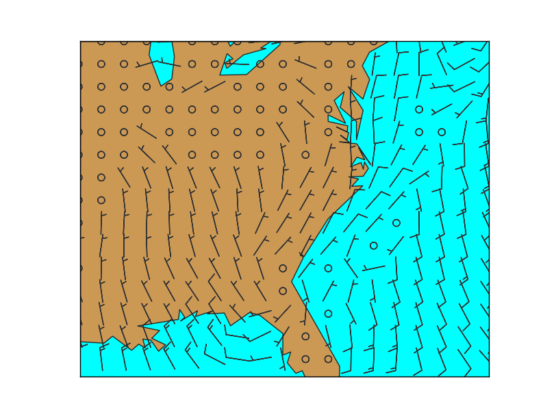
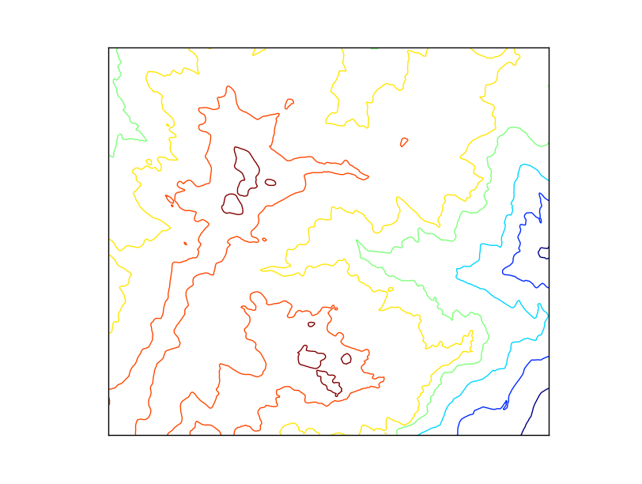
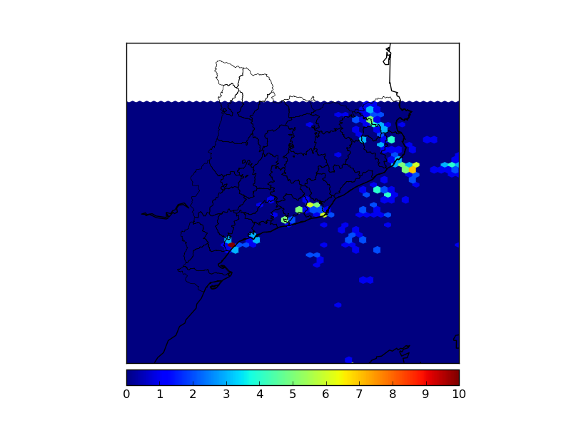
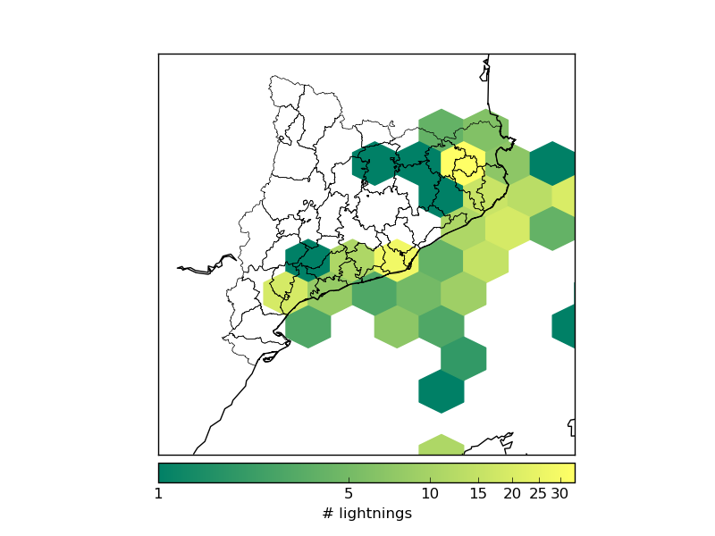
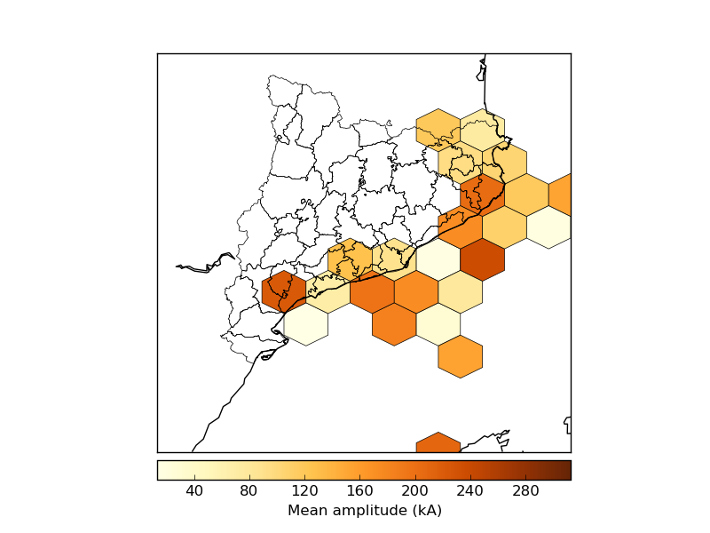
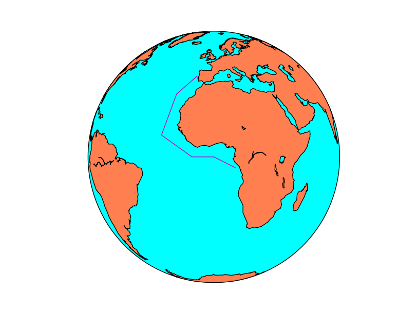
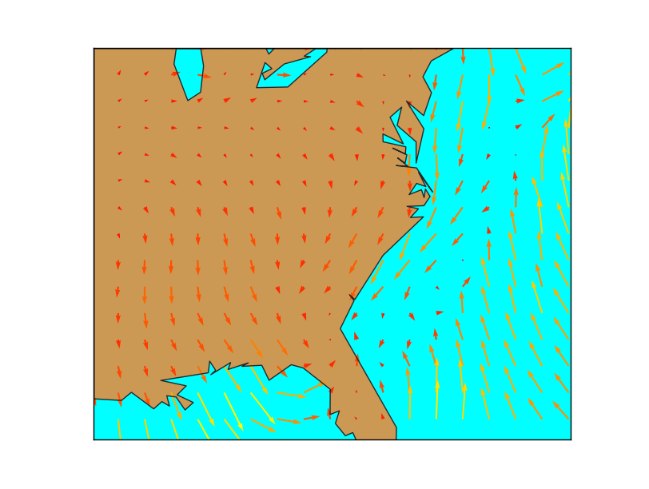
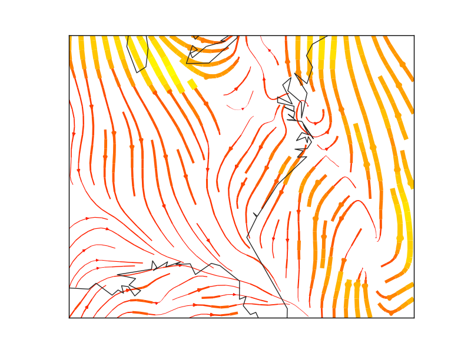
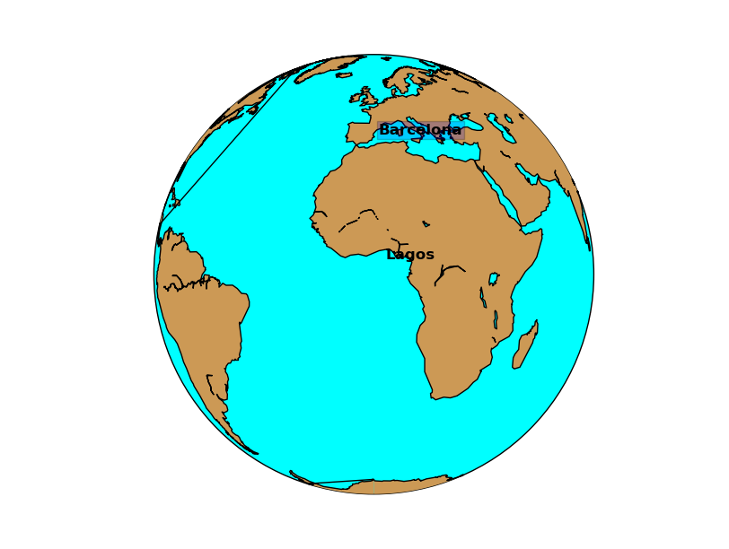

Plotting data
=============

.. _annotate:

annotate
--------

Creates text with an arrow indicating the point of interest. To create a :ref:`text` without an arrow, look at the :ref:`text` section.

`annotate(*args, **kwargs) <http://matplotlib.org/api/pyplot_api.html#matplotlib.pyplot.annotate>`_

* The text method does not belong to Basemap, but directly to matplotlib, so it must be called from the plot or axe instance
* The first argument is the text string
* xy is a list with the x and y coordinates of the point pointed by the arrow. This will be interprete depending on the xycoords argument
* xycoords indicates the type of coordinates used in xy:
    * data means the coordinates are the ones used by the data (the projection coordinates)
    * offset points means an offset in points
    * axes pixels indicates pixels from the lower left corner of the axes
    * The other options are at the `annotation docs <http://matplotlib.org/api/text_api.html#matplotlib.text.Annotation>`_
* xytext a list with the x and y coordinates of the text, an the beginning of the arrow
* textcoords indicates the type of coordinates used in xytext, with the same options as in xycoords
* arrowprops this optional argument sets the arrow properties, as explained in the `Line2D <matplotlib.org/api/lines_api.html#matplotlib.lines.Line2D>`_ docs
* color the color of the text. `This page explains all the color options <http://matplotlib.org/api/colors_api.html>`_

.. literalinclude:: ../code_examples/plotting_data/annotate.py

.. _barbs:

barbs
-----

Plots wind barbs on the map

`barbs(x, y, u, v, *args, **kwargs) <http://matplotlib.org/basemap/api/basemap_api.html#mpl_toolkits.basemap.Basemap.barbs>`_

`The barbs docs from the matplotlib documentation <http://matplotlib.org/api/pyplot_api.html#matplotlib.pyplot.barbs>`_ is much more detailed.

* x and y give the positions of the grid data if the latlon argument is true, the valeus are supposed to be in geographical coordinates. If not, in the map coordinates
* u and v are the north-south and west-east magnitudes of the wind in knots (the values to create the barbs are 5, 10, 15 and so on)

There are many other optional arguments, `documented at the matplotlib docs <http://matplotlib.org/api/pyplot_api.html#matplotlib.pyplot.barbs>`_. Some interesting arguments are:

* pivot changes the point of rotation of the barbs. By default is 'tip', but can be changed to 'middle'
* barbcolor changes the color. If a sequence, the colors are alternated with the sequence values
* fill_empty fills the circles when the wind is lower than 5 kt
* barb_increments can be used to change the values where the barbs add ticks and flags

.. literalinclude:: ../code_examples/plotting_data/barbs.py

* The main problem when using barbs is that the point density may be too high, and the method can't skip points by itself. 
	* To do it, a matrix taking only 1/4 th of the elements is created
	* The matrix points has the element positions to take
	* The arguments passed to barbs are selected using the points matrix, so taking only one of every 4 elements
* The pivot argument has been used to rotate the barbs from the middle, since the effect rotating from the upper part (pivot = 'tip') creates strange effects when the wind rotates

contour
--------

Creates a contour plot.

`contour(x, y, data) <http://matplotlib.org/basemap/api/basemap_api.html#mpl_toolkits.basemap.Basemap.contour>`_

* x and y are matrices of the same size as data, containing the positions of the elements in the map coordinates
* data is the matrix containing the data values to plot
* The default colormap is *jet*, but the argument *cmap* can be used to change the behaviour
* The argument tri = True makes the grid to be assumed as unstructured. See `this post <http://matplotlib.org/examples/pylab_examples/tricontour_vs_griddata.html>`_ to check the differences
* Other possible arguments are documented in the `matplotlib function docs <http://matplotlib.org/api/pyplot_api.html#matplotlib.pyplot.contour>`__
* Labels can be added to the contour result, as in the :ref:`basic_contour` example at basic functions section

.. literalinclude:: ../code_examples/plotting_data/contour.py

contourf
--------

Creates a filled contour plot.

`contourf(x, y, data) <http://matplotlib.org/basemap/api/basemap_api.html#mpl_toolkits.basemap.Basemap.contourf>`_

* x and y are matrices of the same size as data, containing the positions of the elements in the map coordinates
* data is the matrix containing the data values to plot
* The default colormap is *jet*, but the argument *cmap* can be used to change the behaviour
* The argument tri = True makes the grid to be assumed as unstructured. See `this post <http://matplotlib.org/examples/pylab_examples/tricontour_vs_griddata.html>`_ to check the differences
* Other possible arguments are documented in the `matplotlib function docs <http://matplotlib.org/api/pyplot_api.html#matplotlib.pyplot.contourf>`__

.. literalinclude:: ../code_examples/basic_functions/contourf.py
	:emphasize-lines: 22
.. image:: images/basic_functions/contourf.png

.. _hexbin:

hexbin
------

Plots an hexagonal bin from a set of positions. Can plot the number of occurrences in each bin (hexagon) or give a weight to each occurence

`hexbin(x, y, **kwargs) <http://matplotlib.org/basemap/api/basemap_api.html#mpl_toolkits.basemap.Basemap.hexbin>`_

The information is much better at `the matplotlib.hexbin docs <http://matplotlib.org/api/pyplot_api.html#matplotlib.pyplot.hexbin>`_

* x and y are numpy arrays with the coordinates of the points. Regular lists won't work, they have to be numpy arrays.
* gridsize sets the number of bins (hexagons) in the x direction. By default is 100
* C argument is also a numpy array with the values at each point. Those values are processed by default with numpy.mean function at each bin (hexagon)
* reduce_C_function is the function applied to the elements in each bin (hexagon). By default, is numpy.mean
* bins argument can change the behaviour of the counting function. 
	* By default is None, which means that the number of occurrences are plotted. 
	* 'log' makes the logarithm of the number of occurrences is plotted
	* An integer value divides the number of occurrences by this number (useful for percentages if the number is the total of points) 
	* A sequence makes the lower bound of the bin to be used 
* mincnt is the minimum of occurrences in each bin (hexagon) to be plotted. By default is 0, so to avoid plotting hexagons without occurrences, set it to 1
* cmap sets the color map
* edgecolors is the color of the hexagons border. This linewidths argument must not be None to see a result
* linewidths is the line width of the edge of the hexagons. By default is None, so no borders are plot
* alpha sets the transparency of the layer

.. note:: Old versions of the library don't supoort hexbin

.. literalinclude:: ../code_examples/plotting_data/hexbin.py
	:linenos:
	
* The example creates four examples to show different options
* Lines 14 to 25 read all the points, corresponding to lighning data, as explained at the section :ref:`shapefile_points`.
* The first example shows the minimum use of hexbin. Note that the bins are quite small, that the zones with no occurrences are plotted with dark blue while the zones outsode the shaefile data bounding box stay without data
* The second example changes the bin (hexagon) size using the gridsize argument, sets a minimum of occurrences to plot the data with mincnt and makes the colors to behave in a logarithmic scale with bins. Note that the color bar shows the value of the logarithm
* To avoid the color bar to show the logarithm value, I found `this solution at StackOverflow <http://stackoverflow.com/questions/17201172/a-logarithmic-colorbar-in-matplotlib-scatter-plot>`_ that substitutes the bins argument but draws the same while getting a better color bar
* The last example shows how to use the C argument. 
    * The amplitude module of the lightning has been stored at the c variable, and passed to the C argument 
	* The reduce_C_function argument is used to show the maximum value in each bin instead of the mean
	* linewidths and edgecolors make a border to be plotted in each hexagon

    Basic usage

.. figure:: images/plotting_data/hexbin2.png
    :alt: Log scale, different hexagon size
    :figclass: align-center

    Log scale, different hexagon size

    Log scale with a more convenient color bar

    Using the C argument and plotting the bin edges

pcolor
------

The behaviour of this function is almost the same as in :ref:`pcolormesh`. A good explanation `here <http://thomas-cokelaer.info/blog/2014/05/matplotlib-difference-between-pcolor-pcolormesh-and-imshow/>`_

.. _pcolormesh:

pcolormesh
----------

Creates a pseudo-color plot

`pcolormesh(x, y, data, *args, **kwargs) <http://matplotlib.org/basemap/api/basemap_api.html#mpl_toolkits.basemap.Basemap.pcolormesh>`_

* x and y are matrices of the same size as data, containing the positions of the elements in the map coordinates
* data is the matrix containing the data values to plot
* The default colormap is *jet*, but the argument *cmap* can be used to change the behaviour
* Other possible arguments are documented in the `matplotlib function docs <http://matplotlib.org/api/pyplot_api.html#matplotlib.pyplot.pcolormesh>`__

.. literalinclude:: ../code_examples/basic_functions/pcolormesh.py
	:emphasize-lines: 22
.. image:: images/basic_functions/pcolormesh.png

plot
----

Plots markers or lines on the map

The function has the following arguments:

`plot(x, y, *args, **kwargs) <http://matplotlib.org/basemap/api/basemap_api.html#mpl_toolkits.basemap.Basemap.plot>`_

* x and y can be either a float with the position of a marker in the projection units, or lists with the points form drawing a line
* If latlon keyword is set to True, x,y are intrepreted as longitude and latitude in degrees. Won't work in old *basemap* versions
* By default, the marker is a point. `This page explains all the options <http://matplotlib.org/api/markers_api.html>`_
* By default, the color is black (k). `This page explains all the color options <http://matplotlib.org/api/colors_api.html>`_

The first example shows a single point:

.. literalinclude:: ../code_examples/basic_functions/point.py
	:emphasize-lines: 11-13
.. image:: images/basic_functions/point.png

If the arguments are arrays, the output is a line (without markers in this case):

.. literalinclude:: ../code_examples/plotting_data/plot_line.py
	:emphasize-lines: 11-17

quiver
------

Plots a vector field on the map. Many of the behaviour is similar to the :ref:`barbs` method.

`quiver(x, y, u, v, *args, **kwargs) <http://matplotlib.org/basemap/api/basemap_api.html#mpl_toolkits.basemap.Basemap.quiver>`_

The `documentation at matplotlib <http://matplotlib.org/api/pyplot_api.html#matplotlib.pyplot.quiver>`_ is much more detailed than at the basemap docs. 

* x and y give the positions of the grid data if the latlon argument is true, the valeus are supposed to be in geographical coordinates. If not, in the map coordinates
* u and v are the north-south and west-east magnitudes
* The fifth argument, which is optional, sets a value to assign the color to the arrow
* scale makes the arrows to be longer or shorter
* minshaft value below which arrow grows. The value should be greater than 1
* pivot changes the point of rotation of the arrows. By default is 'tip', but can be changed to 'middle'

.. literalinclude:: ../code_examples/plotting_data/quiver.py

* The main problem when using quiver is that the point density may be too high, and the method can't skip points by itself. 
	* To do it, a matrix taking only 1/4 th of the elements is created
	* The matrix points has the element positions to take
	* The arguments passed to barbs are selected using the points matrix, so taking only one of every 4 elements
* The wind speed is calculated to pass the color values to the quiver method. The length of the array must be the same as in x, y, u & v, of course

scatter
-------

Plot multiple markers on the map

`scatter(x, y, *args, **kwargs) <http://matplotlib.org/basemap/api/basemap_api.html#mpl_toolkits.basemap.Basemap.scatter>`_

* x and y is a list of points to add to the map as markers
* If latlon keyword is set to True, x,y are intrepreted as longitude and latitude in degrees. Won't work in old *basemap* versions
* By default, the marker is a point. `This page explains all the options <http://matplotlib.org/api/markers_api.html>`_
* By default, the color is black (k). `This page explains all the color options <http://matplotlib.org/api/colors_api.html>`_

.. literalinclude:: ../code_examples/basic_functions/scatter.py
	:emphasize-lines: 11-17
.. image:: images/basic_functions/scatter.png

streamplot
----------

Plots streamlines from a vectorial field. 

`streamplot(x, y, u, v, *args, **kwargs) <http://matplotlib.org/basemap/api/basemap_api.html#mpl_toolkits.basemap.Basemap.streamplot>`_

* x and y are matrices of the same size as *u* and *v* data, containing the positions of the elements in the map coordinates. 
	* `As the docs explain <http://matplotlib.org/api/pyplot_api.html#matplotlib.pyplot.streamplot>`_, x and y must be evenly spaced. This mean that when the original values come from a different projection, the data matrix must be re-projected, and the x and y matrices re-calculated, as you can see in the example.
	* To calculate an evenly spaced grid, the method :ref:`makegrid` can be used. It's better to use the *returnxy=True* attribute to get the grid in the map projection units.  
* u and v are the x and y velocities. The dimensions must be the same as *x* and *y*
* color can set the same color for the streamlines, or change depending of the data:
	* If the value is a scalar, all the streamlines will have the indicated color, depending on the colormap
	* If the value is an array of the same size as data (the module of the wind in the example), the color will change according to it, using the color map
* cmap sets the `color map <http://matplotlib.org/api/colors_api.html>`_
* linewidth sets the width of the streamlines in a similar way as the color
	* If is a scalar, all the streamlines have the indicated width
	* If is an array, the streamline width will change according to the values of the array
* density sets the closeness of streamlines to plot. a 1 value means the domains is divided in 30x30, with only one streamline crossing each sector. If a list with two elements is passed, the x and y densities are set to different values
* norm  Normalizes the scale to set luminance data
* arrowsize scales thearrow size
* arrowstyle stes the arrow style. The docs are at `FancyArrowPatch <http://matplotlib.org/1.3.0/api/artist_api.html#matplotlib.patches.FancyArrowPatch>`_
* minlength sets the minimum length of the streamline in the map coordinates
* The best documentation for the function is not `the one in Basemap <http://matplotlib.org/basemap/api/basemap_api.html#mpl_toolkits.basemap.Basemap.streamplot>`_, but in `matplotlib <http://matplotlib.org/api/pyplot_api.html#matplotlib.pyplot.streamplot>`_

.. literalinclude:: ../code_examples/plotting_data/streamplot.py
	:emphasize-lines: 15-19

.. note:: The matplotlib and basemap versions must be quite new to use this function. From Ubuntu 14.04, for instance you need to use *sudo pip install --upgrade matplotlib*. Do then the same with Basemap

.. _text:

text
----

Plots a text on the map

`text(x, y, s, fontdict=None, withdash=False, **kwargs) <http://matplotlib.org/api/pyplot_api.html#matplotlib.pyplot.text>`_

* The text method does not belong to Basemap, but directly to matplotlib, so it must be called from the plot or axe instance
* x and y are the coordinates in the map projection. Arrays of coordinates are not accepted, so to add multiple labels, call the metho multiple times
* s is the text string
* withdash creates a text with a dash when set to true
* fontdict can be used to group the text properties

The text can have many many options such as:

* fontsize the font size
* fontweight font wheight, such as bold
* ha horitzontal align, like center, left or right
* va vertical align, like center, top or bottom
* color the color. `This page explains all the color options <http://matplotlib.org/api/colors_api.html>`_
* bbox creates a box around the text: bbox=dict(facecolor='red', alpha=0.5)

.. literalinclude:: ../code_examples/plotting_data/text.py

To draw a text label with an arrow, use :ref:`annotate`.