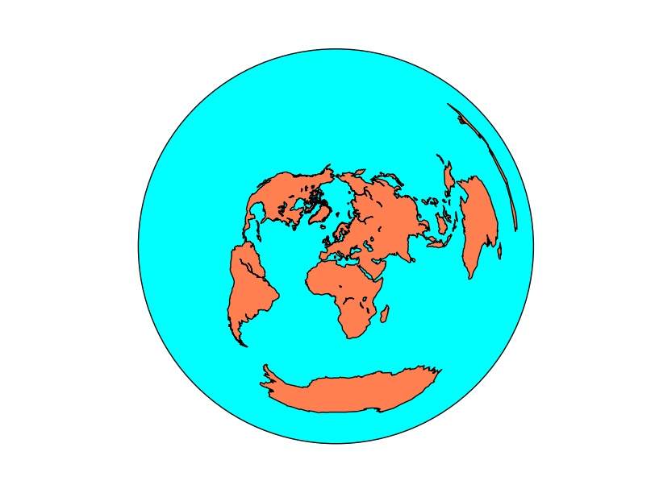
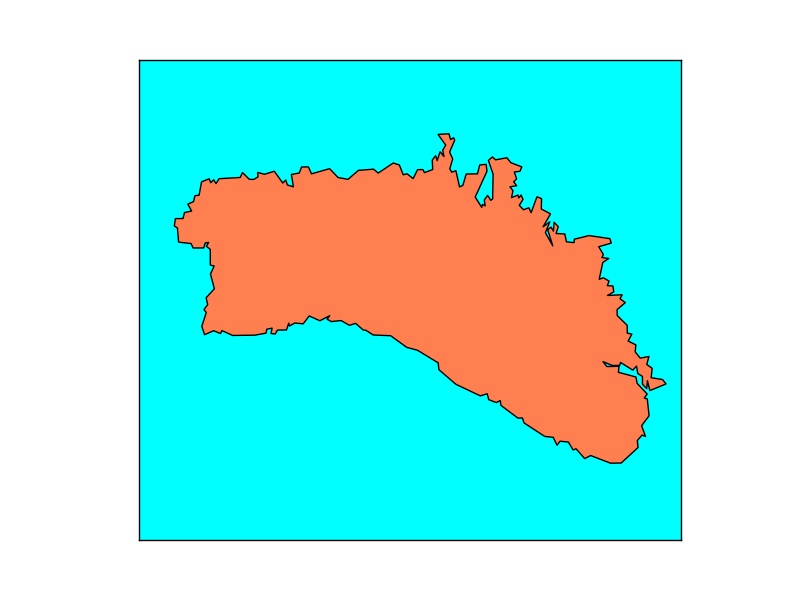
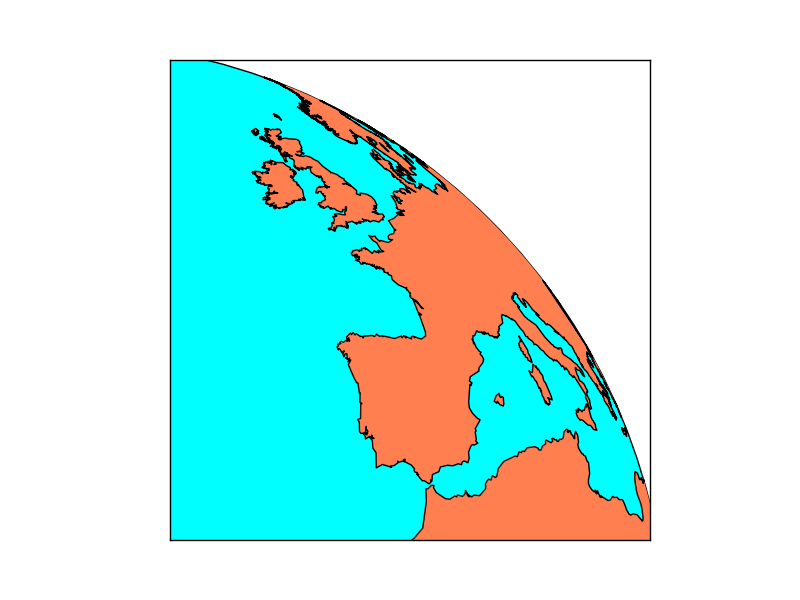
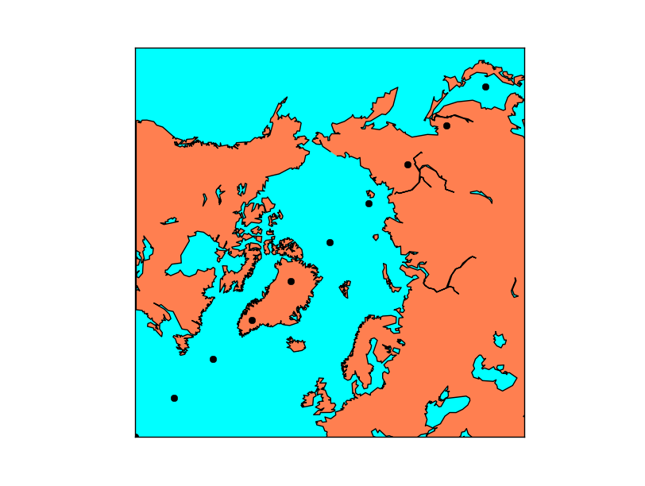

Managing projections
=====================
All maps must have a projection. The projection and its features are all assigned when the object *Basemap* is created.
The way to do it is quite different from other libraries (i.e. GDAL), so understanding this point is very important for working with Basemap.

Projection
----------
The projection argument sets the map projection to be used:

.. literalinclude:: ../code_examples/projections/cyl.py
    :emphasize-lines: 4
.. image:: images/projections/cyl.png

The default value is *cyl*, or `Cylindrical Equidistant projection <http://en.wikipedia.org/wiki/Equirectangular_projection>`_, also known as *Equirectangular projection* or *Plate Carrée*

Many projections require extra arguments:

.. literalinclude:: ../code_examples/projections/aeqd.py
    :emphasize-lines: 4

The map has now an equidistant projection centered at longitude = 10 and latitude = 50, which is over Europe. Some projections require more parameters, described in `each projection page at the manual <http://matplotlib.org/basemap/users/mapsetup.html>`_.

The Basemap object has the field *proj4string* that has the string to be used with `proj4 <http://trac.osgeo.org/proj/>`_ for calculating the projection parameters without using Basemap. 

.. _epsg:

Using epsg to set the projection
^^^^^^^^^^^^^^^^^^^^^^^^^^^^^^^^
The EPSG code is a `standard to name projections using a numerical code <http://spatialreference.org/ref/epsg/>`_. Basemap allows to create the maps using this notation, but only in certain cases. To use it, pass the *epsg* argument to the *Basemap* constructor with the code.

The epsg codes supported by Basemap are at the file *<python_packages_path>/mpl_toolkits/basemap/data/epsg*. Even if the desired epsg appears in the file, sometimes the library can't use the projection, raising the error 

	ValueError: 23031 is not a supported EPSG code

Projections with the name "utm" are not well supported (i.e. 23031 or 15831), but the ones named tmerc can be used. The way I found to do it was opening the file and looking for a suitable option.

This example shows the island of Menorca using the UTM projection, zone 31N.

 .. literalinclude:: ../code_examples/projections/epsg.py

.. _extension:

Extension
---------
All the examples until now take the whole globe. Drawing only a region can be done either passing a bounding box or the center of the map and the map size. The official docs say that both methods can be used most of the times, but there are many exceptions.

.. note:: Using cyl, merc, mill, cea and gall projections, the corners are assumed to be -180, -90, 180, 90 (all the globe) by default if they are not set. The other projection need the extension to be set by one of the three methods.

Passing the bounding box
^^^^^^^^^^^^^^^^^^^^^^^^
.. literalinclude:: ../code_examples/projections/regionbbox.py
    :emphasize-lines: 4-5
.. image:: images/projections/regionbbox.png

The lower-left and upper-right corners are past as parameters, in longitude-latitude units, not in map units. This is the reason why in some projections fails, since a square in longitude-latitude may not give a good bounding box in the projected units.

In the example, the `UTM (Transverse Mercator) projection <http://matplotlib.org/basemap/users/tmerc.html>`_ is used. The bounding box method is easier in this case, since calculating the width in UTM units from the center of the map is much more difficult.

.. note:: Using sinu, moll, hammer, npstere, spstere, nplaea, splaea, npaeqd, spaeqd, robin, eck4, kav7, or mbtfpq projections, this method can't be used. either because all the globe is plotted or because the extension can't be calculated from the geographical coordinates. 

Passing the bounding box in the map coordinates
^^^^^^^^^^^^^^^^^^^^^^^^^^^^^^^^^^^^^^^^^^^^^^^
.. literalinclude:: ../code_examples/projections/regionbboxmc.py
    :emphasize-lines: 5-8

Some projections (the ones that look *like a satellite image*) accept setting the extension using the map coordinates. The projection parameters must be set (center point), and then the zone to show can be only a part of the globe.

.. note:: Only ortho, geos and nsper projections can use this method to set the map extension

Passing the center, width and height
^^^^^^^^^^^^^^^^^^^^^^^^^^^^^^^^^^^^
.. literalinclude:: ../code_examples/projections/regioncenter.py
    :emphasize-lines: 4-8

In this case, the center of the projection, the width and height of the projection are passed as parameters.

The center is easy, just pass it in longitude-latitude. The size is a bit more tricky:

The units are the projection units in meters. The point *(0, 0)* is the lower left corner, and the point *(width, height)* is the upper right. So the origin of the positions is *not* the one defined by the projection as in GDAL. The projection just defines the size of the units used, not the origin.

The example shows the position of several points using the *plot* function to show how the coordinates range from 0 to width and height.