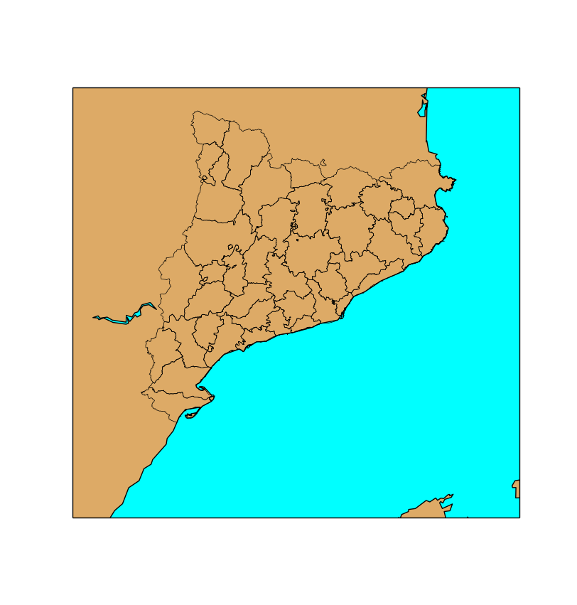
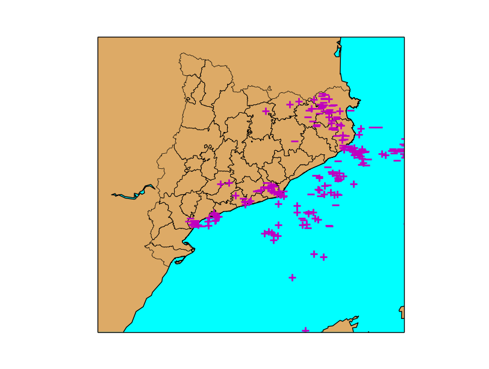
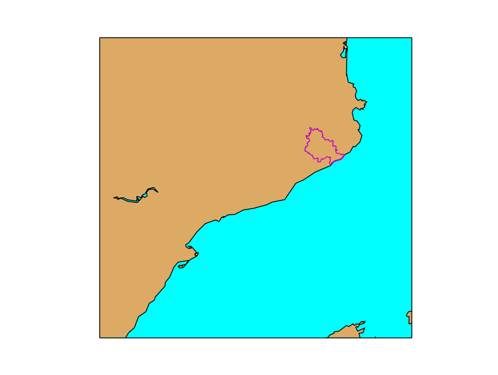
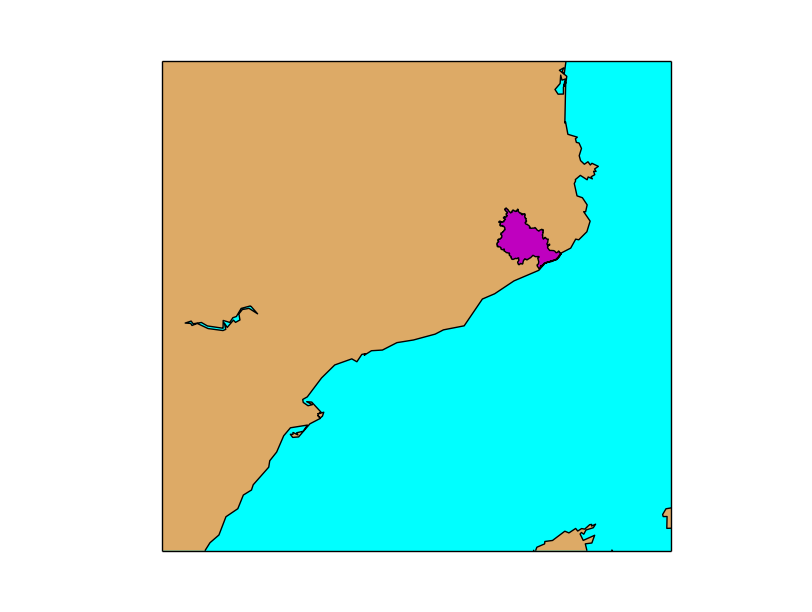

Working with shapefiles
-----------------------
The way used by Basemap to handle vectorial files is quite different from other libraries, and deserves some attention.

Basic usage
^^^^^^^^^^^
Let's start with the easiest way to plot a shapefile:

.. literalinclude:: ../code_examples/shapefile/readshapefile_polygon.py
    :emphasize-lines: 11

* The first parameter shapefile name must go without the shp extension. The library assumes that all shp, sbf and shx files will exist with this given name
* The second parameter is a name to access later to the shapefile information from the Basemap instance, as we will show later

There are some restrictions: 

* The file must be in EPSG:4326, or lat/lon coordinates. If your file isn't, you can use ogr2ogr to transform it
* The elements must have only 2 dimensions
* This example will show something only if the elements are polygons or polylines

As the image shows, the result will be only the boundary of the polygons (or the polylines). To fill them, look at the last section :ref:`fillingpolygons`

.. _shapefile_points:

Reading point data
^^^^^^^^^^^^^^^^^^
Plotting points is a bit more complicated. First, the shapefile is read, and then the points can be plotted using scatter, plot or the matplotlib function that fits better the needs.

.. literalinclude:: ../code_examples/shapefile/readshapefile_points.py
    :emphasize-lines: 13-22

The example shows the lightnings fallen over Catalonia during a storm

* The second parameter has been named lightnings, and the Basemap instance map, so the shapefile elements can be accessed using map.lightnings for geometries and map.lightnings_info for accessing the elements fields
* The shapefile method returns a sequence with the number of elements, the geometry type with the codes defined `here <http://shapelib.maptools.org/shp_api.html>`_ and the bounding box
* Line 17 shows a possible way to iterate all the elements
    * zip will join each geometry with its field values
    * each element can be iterated with a for as when iterating a dict
* In the example, a field named amplitude can be used to guess if the lightning had positive or negative current and draw a different symbol for each case
* The points are plotted with the method plot, using the marker attribute to change the symbol

Polygon information
^^^^^^^^^^^^^^^^^^^
This example shows how to use the shapefile attributes to select only some geometries.

.. literalinclude:: ../code_examples/shapefile/readshapefile_polygon_info.py
    :emphasize-lines: 13-16

* To iterate all the elements, use zip as in the last example
* There is a field called 'nombre' that can be used to filter. In the example only the value 'Selva' is selected
* To plot a line, the x and y coordinates must be in separated arrays, but the geometry gives each point as a pair. There is an explanation on how to do it 'here <http://stackoverflow.com/questions/13635032/what-is-the-inverse-function-of-zip-in-python>'_
* The shape is plotted using the plot method, eliminating the markers to get only a line

.. _fillingpolygons:

Filling polygons
^^^^^^^^^^^^^^^^
The basic way to plot a shapefile doesn't fill the polygons if this is the shape type. Here's how to do it:

.. literalinclude:: ../code_examples/shapefile/readshapefile_polygon_fill.py
    :emphasize-lines: 20-26

* matplotlib uses a class called PatchCollection, which is a set shaped to add filled polygons, as explained `at the official docs <http://matplotlib.org/examples/api/patch_collection.html>`_. 
* The shapes, in this case, are of the type Polygon. To create it, the coordinates must be in a numpy array. The second argument sets the polygon to be closed

I learned it how to do it `at StackOverflow <http://stackoverflow.com/questions/15968762/shapefile-and-matplotlib-plot-polygon-collection-of-shapefile-coordinates>`_
