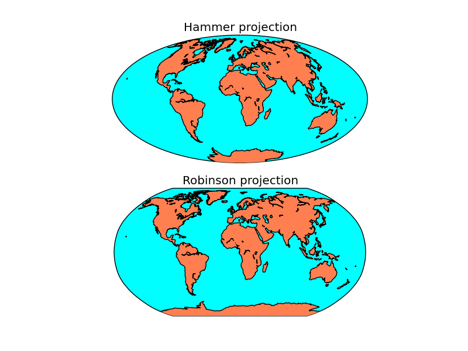
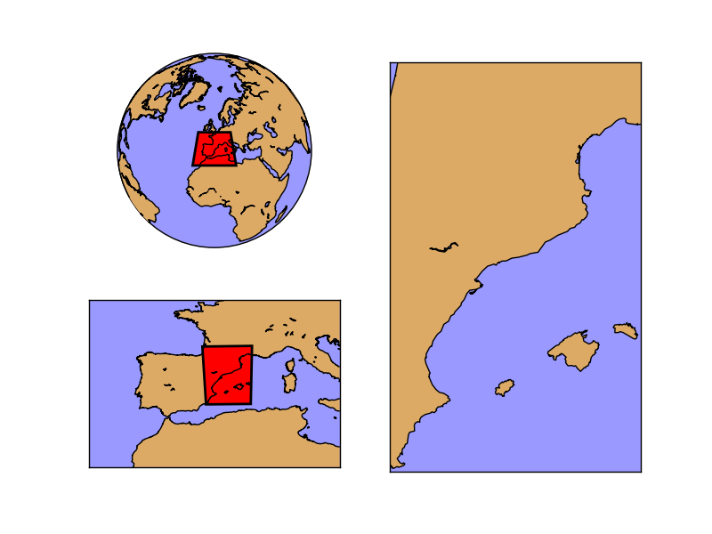
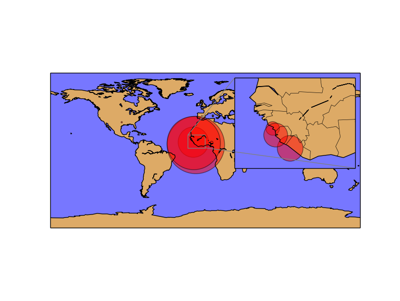

Multiple maps using subplots
----------------------------

Drawing multiple maps in the same figure is possible using matplotlib's *subplots*. There are several ways to use them, and depending on the complexity of the desired figure, one or other is better:

* Creating the axis using subplot directly with add_subplot
* Creating the subplots with pylab.subplots
* Using subplot2grid
* Creating :ref:`inset_locator`

Using add_subplot
^^^^^^^^^^^^^^^^^
This is the prefered way to add subplots in most of the examples:

.. literalinclude:: ../code_examples/cookbook/subplots.py 
	:emphasize-lines: 4-6
	
* Before calling the basemap constructor, the fig.add_subplot method is called. The three numbers are:
	# The number of rows in the final figure
	# The number of columns in the final figure
	# Which axis (subplot) to use, counting from the one top-left axis, as explained at `this StackOverflow question <http://stackoverflow.com/questions/3584805/in-matplotlib-what-does-111-means-in-fig-add-subplot111>`_
* Once the axis is created, the map created later will use it automatically (although the ax argument can be passed to use the selected axis)
* A title can be added to each subplot using set_title()

Generating the subplots at the beginning with plt.subplots
^^^^^^^^^^^^^^^^^^^^^^^^^^^^^^^^^^^^^^^^^^^^^^^^^^^^^^^^^^
Using the add_subplot is a bit confusing in my opinion. If the basemap instance is created without the *ax* argument, the possibility of coding bugs is very high. So, to create the plots at the beginning and using them later, pyplot.subplots can be used:

.. literalinclude:: ../code_examples/cookbook/subplots_alternative.py 
	:emphasize-lines: 4
	
* The arguments passed to the subplots method, are the number of rows and columns to be created 
* The subplots method returns figure object, and a list of the created axes (subplots), where the first element is the one at the top-left position
* When creating the basemap instance, the ax argument must be passed, using the created axes 

The result is the same as in the previous example

Using subplot2grid
^^^^^^^^^^^^^^^^^^
When the number of subplots is bigger, or the subplots must have different sizes, *subplot2grid* or *gridspec* can be used. Here is an example with subplor2grid:

.. literalinclude:: ../code_examples/cookbook/subplot2grid.py

* Each subplot is created with the method `subplot2grid <http://matplotlib.org/users/gridspec.html>`_. The three possible arguments are:
	# The output matrix shape, in a sequence with two elements, the y size and x size
	# The position of the created subplot in the output matrix
	# The rowspan or colspan. As in the `html tables <http://www.w3schools.com/tags/att_td_rowspan.asp>`_, the cells can occuy more than one position in the output matrix. The rowspan and colspan arguments can set it, as in the example, where the second column has only one cell occupying two rows
* In the example, the layout is used to show different zoom levels. Each level is indicated with a polygon on the previous map. To create these indicators:
	* The position of each corner of the bounding box is calculated
		* The corners can be retrieved using the xmin, xmax, ymin, ymax fields of the basemap instance (the next map, since this will indicate the zoomed area)
		* Since the fields are in the projected units, the basemap instance with inverse argument is used. See the :ref:`converting_units` section to see how does it work
		* The calculated longitudes and latitudes of each corner is passed to the current map instance to get the coordinates in the current map projection. Since we have the values in a sequence, an asterisk is used `to unpack them <https://docs.python.org/2/tutorial/controlflow.html#unpacking-argument-lists>`_
	* Once the points are known, the polygon is created using the `Path class <http://matplotlib.org/users/path_tutorial.html>`_
	

Inset locators
^^^^^^^^^^^^^^

A small map inside the main map can be created using :ref:`inset_locator`, explained in an other section. The result is better than just creating a small subplot inside the main plot:

