Basemap utility functions
=========================

.. _addcyclic:

addcyclic
---------
Adds a longitude value, and a columns of values to the data array. Useful to fill the missing data when the data covers the whole longitudes.

`mpl_toolkits.basemap.addcyclic(arrin, lonsin) <http://matplotlib.org/basemap/api/basemap_api.html#mpl_toolkits.basemap.addcyclic>`_

* Note that it's not a basemap method, but a separate function
* arrin is the input data. A column will be added to fill the gap between the -180 and 180 longitudes
* lonsin is a single dimension array containing the longitudes

.. literalinclude:: ../code_examples/utilities/addcyclic.py

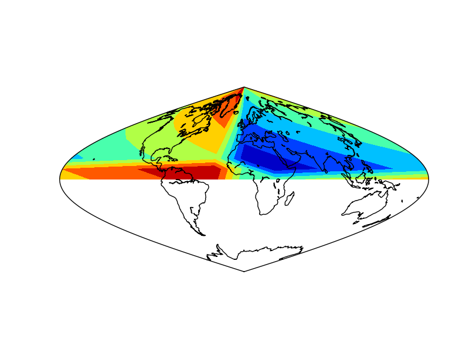

* The example is the same as in :ref:`shiftdata`. The difference is that the white band disappears.
* Note the order of the output variables: longitudes and data
* Note that the longitudes are a one dimension array

colorbars
---------
Draws the color legend at one of the edges of the map. The use is almost the same as in matplotlib colorbar

`colorbar(mappable=None, location='right', size='5%', pad='2%', fig=None, ax=None, **kwargs) <http://matplotlib.org/basemap/api/basemap_api.html#mpl_toolkits.basemap.Basemap.colorbar>`_

* mappable is the most important argument. Is the field on the map to be explained with the colorscale. It can be a contourf, a pcolormesh, contour, etc. If the value is None, the last drawn field is represented
* location sets the border of the map where the color scale is drawn. Can be top, right, left or bottom
* size sets the width of the color bar, in % of the parent axis
* pad sets the separation between the axes and the color bar, also in % of the parent axis
* fig is the figure the colorbar is associated with

Most of the matplotlib.colorbar arguments will work too, such as label

The colorbar method returns an object, which has some interesting methods too:

* add_lines adds to the color bar, the lines from an other field (look at the example to see how does it work)
* set_ticks changes the positions of the ticks and labels on the color bar

.. literalinclude:: ../code_examples/utilities/colorbar.py

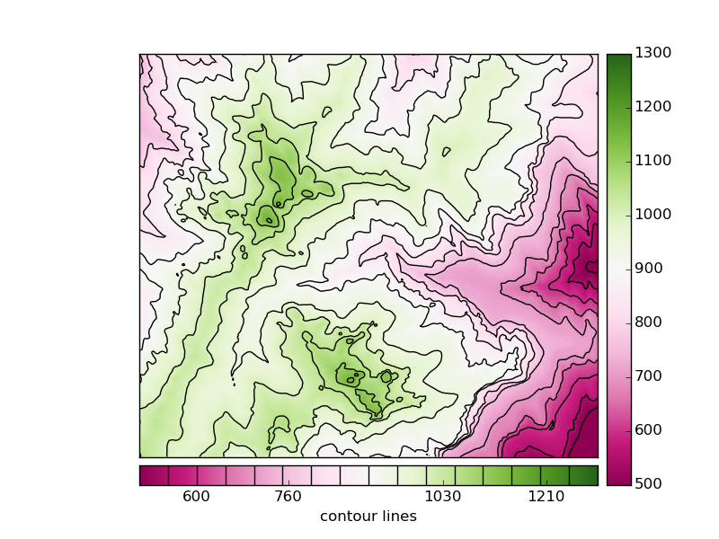

* A colormesh and a contour fields are plotted, to be able to use some advanced colorbar attributes
* The first colorbar (line 27), shows the default use of the colorbar. The pcolormesh is passed as the argument, to force the method to draw this one instead of the contour field
* The second colorbar uses some more arguments
	* The position is changed to bottom
	* A label is set
	* The method add_lines is used with the contour field, so the colorbar shows the pcolormesh and contour field legends at once
	* The ticks are set at random positions, to show how to change them
	
To see an example with logarithmic scales, take a look at the :ref:`hexbin` example
 
drawmapscale
------------
Draws the scale of the map at the indicated position

`drawmapscale(lon, lat, lon0, lat0, length, barstyle='simple', units='km', fontsize=9, yoffset=None, labelstyle='simple', fontcolor='k', fillcolor1='w', fillcolor2='k', ax=None, format='%d', zorder=None) <http://matplotlib.org/basemap/api/basemap_api.html#mpl_toolkits.basemap.Basemap.drawmapscale>`_

* lon and lat indicate the position of the scale on the map. The fact that the geographical coordinates must be used is a problem, since there's no possibility to put the scale outside the map
* lon0 lat0 indicate the location where the scale is calculated
* length is the number of kilometers to represent in the scale
* barstyle can be 'simple' or 'fancy', and changes the scalebar style. Both styles are represented in the example
* units indicates the units to represent in the scale, kilometers by default
* fontsize changes the font size of the units drawn on the scale bar
* fontcolor sets the font color of the units drawn on the scale bar
* yoffset controls the height of the scalebar. By default is 0.02 times the height of the map. It doesn't seem to work properly in all the versions
* fillcolor1 and fillcolor2 set the colors of the bar at the scale bar when the style is 'fancy'
* format sets the number format on the scale bar

.. note:: The projection *cyl* (lat/lon), which is the default, can't use this method. More informatino `here <http://sourceforge.net/p/matplotlib/mailman/message/23863531/>`_. 

.. literalinclude:: ../code_examples/utilities/drawmapscale.py

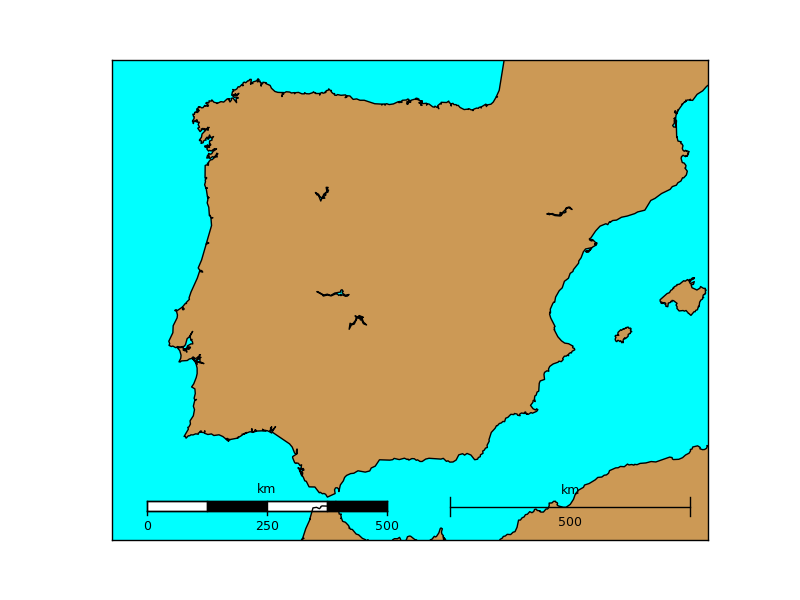

gcpoints
--------
Calculates n points along a great circle given two coordinates

`gcpoints(lon1, lat1, lon2, lat2, npoints) <http://matplotlib.org/basemap/api/basemap_api.html#mpl_toolkits.basemap.Basemap.gcpoints>`_

* lon1 and lat1 are the geographical coordinates of the initial point
* lon2 and lat2 are the geographical coordinates of the final point
* npoints is the number of points to calculate

.. note:: To draw a great circle, the :ref:`greatcircle` function it may be easier to use. This function is useful to get the points values, or draw cases when greatcircle fails because of edges problems

.. literalinclude:: ../code_examples/utilities/gcpoints.py
	:emphasize-lines: 10
	

.. _greatcircle:

greatcircle
-----------
`A great circle <http://en.wikipedia.org/wiki/Great_circle>`_ is the maximum circle that can be drawn that passes through two points in a sphere (excepting when the points are the antipodes)

`drawgreatcircle(lon1, lat1, lon2, lat2, del_s=100.0, **kwargs) <http://matplotlib.org/basemap/api/basemap_api.html#mpl_toolkits.basemap.Basemap.drawgreatcircle>`_

* lon1 and lat1 are the longitude and latitude of the starting point
* lon2 and lat2 are the longitude and latitude of the ending point
* del_s is the number of kilometers that separate each point of the great circle. Defaults to 100
* linewidth argument sets the width of the line
* color sets the color of the line. `This page explains all the color options <http://matplotlib.org/api/colors_api.html>`_

.. note:: If the circle gets cut by the edges of the map, i.e. starts at longitude -179 and ends at 179, the method can't handle it properly

.. literalinclude:: ../code_examples/utilities/drawgreatcircle_mercator.py

When using Mercator projection, the meridians and parallels are straight lines, but the great circles usually are not

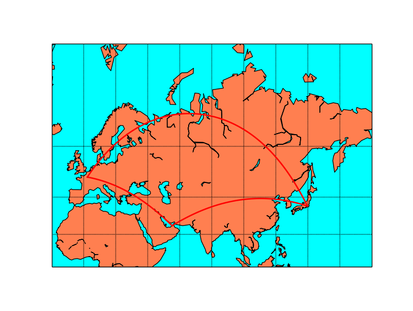

.. literalinclude:: ../code_examples/utilities/drawgreatcircle_gnomonic.py

The gnomonic projection makes the great circles to be a straight line in any direction:

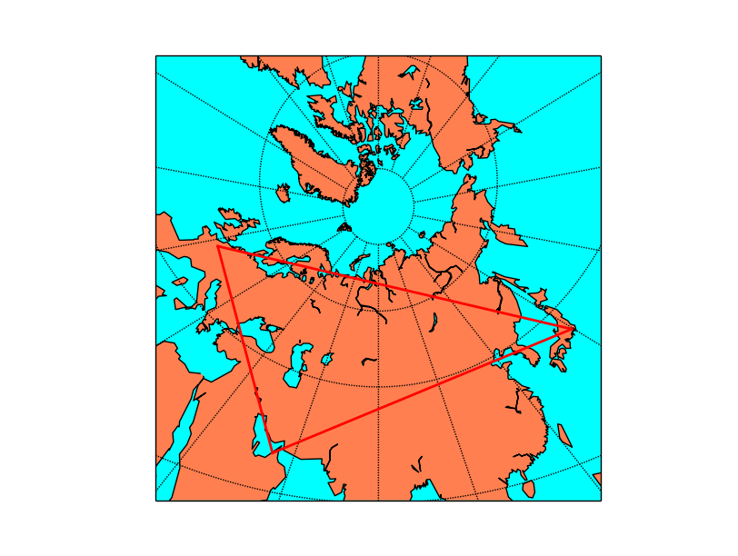

.. _interp:

interp
------
Interpolates a grid to another grid, with different sizes. 

Useful to create smoother plots or to have more elements when using barbs or quiver. Also useful when using :ref:`maskoceans`.

`interp(datain, xin, yin, xout, yout, checkbounds=False, masked=False, order=1) <http://matplotlib.org/basemap/api/basemap_api.html#mpl_toolkits.basemap.interp>`_

* This function is not a method of the basemap instance, but a separate one in the basemap module
* datain is the data array to interpolate. It has to be a 2d numpy array
* xin and yin are the coordinates of the input data array, in one dimension each. 
	* This point is important, since implies that the input grid has to be regular (so no lon-lat grid in a different projection)
	* y has to be in increasing order
* xout and yout are the coordinates of the output data array. They have to be 2d numpy arrays.
* checkbounds if set to True, the xin and yin values are checked to be in the bounds of xout and yout. If False, and there are values outside the bounds, the output data array values will be clipped to the boundary values
* masked makes the points outside the new grid to be masked if is set to True, or an arbitrary value if given
* order sets the interpolation method:
	* 0 uses the nearest neighbor method
	* 1 uses a bilinear interpolation
	* 3 uses a cubic spline, and requires scipy.ndimage to be installed 

.. literalinclude:: ../code_examples/utilities/interp.py

* The example is taken from the :ref:`barbs` method example, but zoomin in a lot so the number of barbs is too low, and gives a reason to interpolate
* The positions of the wind barbs (x, y) are calculated using the basemap instance
* The new grid is created, using linspace
	* Since the grid is in the map projection, the x and y 2d array can be converted to a 1d array, since the values are the same for all the lines or columns
	* The new grid is created multiplying the number of elements by 2, with the same bounding values, using linspace
	* The new grid has to be in 2d arrays, which is done with the meshgrid method
* interp can be now called
	* Since x and y are two dimension arrays, only a single column is passed for x, and a single column for y
	* y axis is not in increasing order (coordinates gofrom north to south), so they have to be reversed using the `numpy.flipud <http://docs.scipy.org/doc/numpy/reference/generated/numpy.flipud.html>`_ method. The output has to be reversed again to have the data properly ordered 
* Once the new grid is created, the barbs can be drawn in the new resolution 
 
.. image:: images/utilities/interp.png 

In gray, the original points, and in red, the interpolated ones

is_land
-------
Returns *True* if the indicated point is on the land, and *False* if on an ocean or lake

`is_land(xpt, ypt) <http://matplotlib.org/basemap/api/basemap_api.html#mpl_toolkits.basemap.Basemap.is_land>`_

* xpt and ypt are the point coordinates where the land/water has to be calculated. 
	* The coordinates must be in the map coordinates
	* The resolution indicated in the Basemap constructor must not be None
	* The indicated resolution polygon will be used to calculated if the point is on a land zone, so the results change depending on that
* No arrays of coordinates are allowed, so the query must be done point by point
* `There is an alternative way to calculate this for many points <http://stackoverflow.com/questions/13796315/plot-only-on-continent-in-matplotlib/13811775#13811775>`_ using the landpolygons attribute and the matplotlib PATH.contains_points method

.. literalinclude:: ../code_examples/utilities/is_land.py

The alternative way, which accepts multiple points and, in fact could be used with any polygon get from a shapefile (See :ref:`fillingpolygons`)

.. literalinclude:: ../code_examples/utilities/is_land_alternative.py

* locations is a numpy array containing numpy arrays with the projected points
* The PATH objects are calculated for each of the polygons 
* For each PATH, all the points are evaluated using contains_points. The result is casted into a numpy array so can be added with the previous evaluations. If one of the polygons contains the point, the result element will be true

.. _makegrid:

makegrid 
--------
makegrid method creates an arbitrary grid of equally spaced points in the map projection. Used to get the longitudes and latitudes that would form an an equally spaced grid using the map projection.

`makegrid(nx, ny, returnxy=False) <http://matplotlib.org/basemap/api/basemap_api.html#mpl_toolkits.basemap.Basemap.makegrid>`_

* nx and n define the size of the output grid
* If returnxy is set to True, the positions of the grid in the map projection are also returned
* returns the longitudes and latitudes 2D numpy arrays, and the x and y in the map coordinates arrays if returnxy is set to True

.. note: In some old basemap versions, the returnxy argument doesn't work, so map(lons, lats) has to be applied to get the output positions

.. literalinclude:: ../code_examples/utilities/makegrid.py

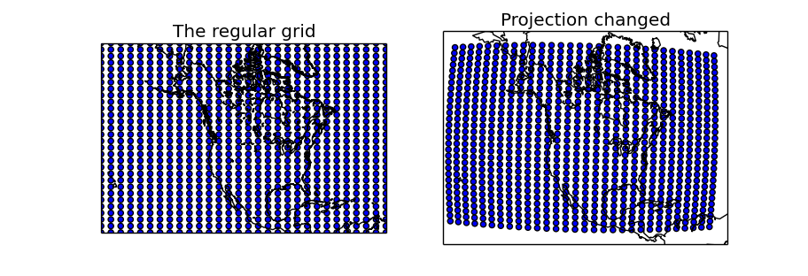

* Two maps are created, one using the same projection as in the regular grid, and the other with another projection to show how to use the created longitudes and latitudes matrices
* makegrid is used with the returnxy set to True
    * The first map uses the x and y matrices directly, since is in the same projection. As expected, the created points form a regular grid of 30x30
    * The second map uses the lons and lats matrices, re-projecting them into the new projection using the basemap instance. The scatter shows that in the new projection, the grid is not regular

.. _maskoceans:

maskoceans
----------
Takes a data array and masks the values at the points in the oceans and lakes

`mpl_toolkits.basemap.maskoceans(lonsin, latsin, datain, inlands=True, resolution='l', grid=5) <http://matplotlib.org/basemap/api/basemap_api.html#mpl_toolkits.basemap.maskoceans>`_

* This function is not a method of the basemap instance, but a separate one in the basemap module
* lonsin and latsin are the location of the points in 2 dimensions arrays. Only latlon projections can be used with this method
* datain is the array containing the values to mask with the oceans
* inland sets if the lakes have to be masked too (true by default)
* resolution selects the resolution of the land-sea boundaries to use then masking the arrays, 'l' by default. The one defined by the basemap instance is not used
* grid sets, in arch minutes, the resolution of the mask grid. 10, 5, 2.5 and 1.25 values are available

* The output array has the same dimensions as the input data array
* See the examples to understand the difference between the resolution and grid arguments

.. literalinclude:: ../code_examples/utilities/maskoceans.py
	:linenos:
	
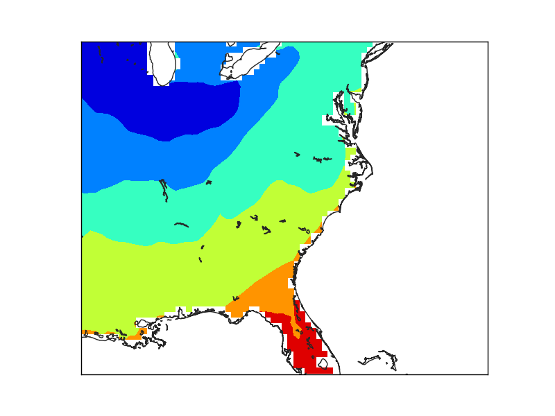

The first example (line 22), creates the mask directly. The result is coarse, due to the low resolution of the input data, not because of the maskoceans arguments

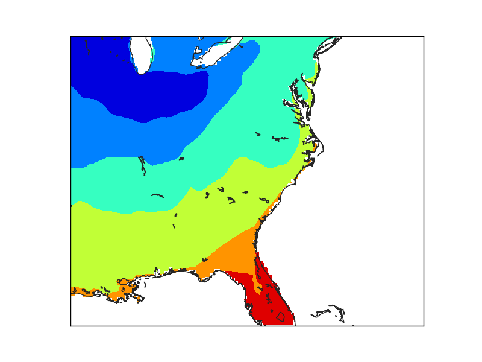

* The second example creates a finer grid (lines 29 to 36) to avoid the effect of the big pixels due to the data. Look at the :ref:`interp` for details
* The maskoceans function, however, is called with the lowest resolution in both grid and resolution arguments. 
* Note that the lakes at Florida are not masked, because the resolution is low, and that the Florida coast still shows the pixels, because of the big grid value. 

In this case, the resolution has been set to 'h', the maximum. The lakes are now masked, but the Florida coast still shows the pixel size used to create the mask.
	

Finally, when the grid is set at the finer resolution, the Florida coast smoothly matches the coast line. 

nightshade
----------
Draws the regions of the map which are dark at the specified date

`nightshade(date, color='k', delta=0.25, alpha=0.5, ax=None, zorder=2) <http://matplotlib.org/basemap/api/basemap_api.html#mpl_toolkits.basemap.Basemap.nightshade>`_

* date is a `datetime.datetime <https://docs.python.org/2/library/datetime.html>`_ object
* color is the color of the drawn shadow
* delta is the resolution to which the shadow zone is calculated. By default is 0.25, and small values fail easily
* alpha is the transparency value
* zorder can change the layer vertical position

The example shows the current dark zones in the `van der Grinten Projection <http://matplotlib.org/basemap/users/vandg.html>`_:

.. literalinclude:: ../code_examples/utilities/nightshade.py

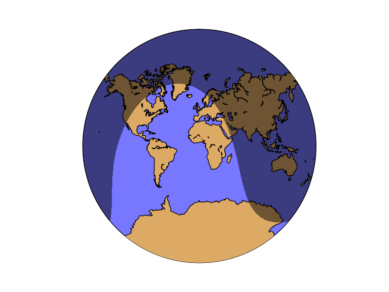

.. _rotate_vector:

rotate_vector
-------------

Given two matrices of the east-west and north-south components of a vectorial field, and the longitude and latitude of the points, rotates the vectors so they represent the direction properly on the map projection

Some functions, such as barbs, quiver or streamplot, that use vectorial data, asks the vector components to be in the map coordinates i.e. u is from left to right, v from up do down. If the available data is in geographical coordinates i.e. west-east and north-south, these coordinates have to be rotated or the vector direction won't be plot properly. This is the aim of the rotate_vector method.

The method :ref:`transform_vector` does the same function, but changing the grid size at the same time (interpolating the points)

`rotate_vector(uin, vin, lons, lats, returnxy=False) <http://matplotlib.org/basemap/api/basemap_api.html#mpl_toolkits.basemap.Basemap.rotate_vector>`_

* uin and vin are the input data matrices. The directions are the geographical, so the u component is west-east and the v component, north-south
* lons, lats are 2D numpy arrays with the positions of the uin an vin matrices, in geographical coordinates
* returnxy makes the method to return the lons and lats matrices reprojected to the map coordinates. Just as calling the basemap instance

.. literalinclude:: ../code_examples/utilities/rotate_vector.py

.. image:: images/utilities/rotate_vector.png 

* lons and lats are created in an equal spaced grid covering all the globe, using `linspace <http://docs.scipy.org/doc/numpy/reference/generated/numpy.linspace.html>`_
* v10 and u10 are created so they represent a south to north wind (v10 = 10, u10 = 0)
* The rotation is done, using the created matrices, and calculating the positions of the locatinos in the map projection (returnxy = True)
* Two maps are drawn, creating the subplots with add_subplot
	* The first draws the barbs without rotating them. Even though they are supposed to be south-north, the basemap instance takes them as if they were in the map projection, so the barbs go from the bottom to the top, which is not south to north
	* The second shows the result of the rotation

set_axes_limits
---------------

This method is usually called internally, and changes the matplotlib axes to the shape of the projection.

`set_axes_limits(ax=None) <http://matplotlib.org/basemap/api/basemap_api.html#mpl_toolkits.basemap.Basemap.set_axes_limits>`_

* ax is the axis instance that needs its limits to be set

Most of the methods, such as drawcountries, drawrivers, readshapefile... call this method at the end, so it's difficult to put an example to show how does it work:

.. literalinclude:: ../code_examples/utilities/set_axes_limits.py

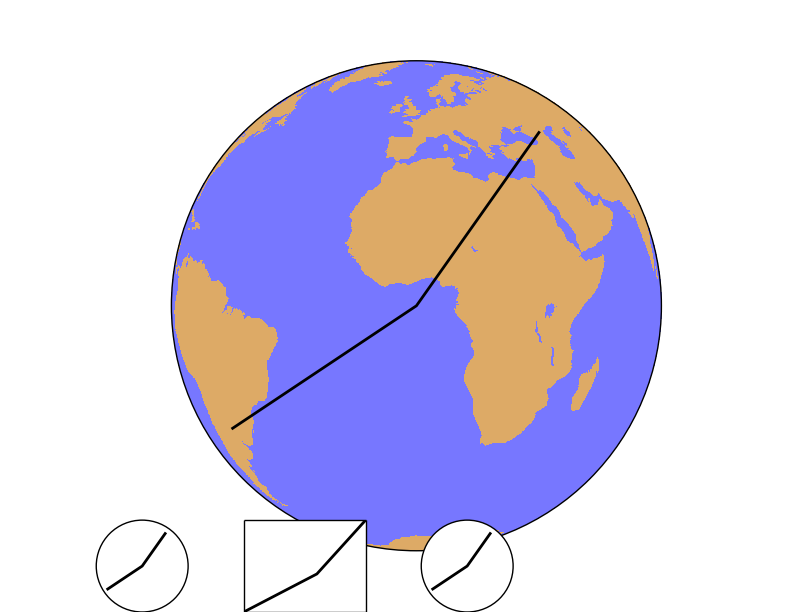

* After creating the map, the points 1, 2 and 3 are calculated in the map coordinates using the Basemap instance
* The line connecting the three points is plot on the main map
* Then, three new axes are created using fig.add_axes(x, y, width, height), in fractions of the plot size. In all the cases, the three points are plotted
	* The first axis uses the set_axes_limits, so the final shape is a circle, correct for the orthographic projection. Note that plot is called as a method from the axis, not from the Basemap instance
	* The second axis example doesn't call the method, so the shape is not correct. The plot method is also called from the axis instance
	* In the third case, the plot method is called from the Basemap instance, so the method set_axes_limits is called internally from the basemap.plot method, and the final shape is correct

.. _shiftdata:

shiftdata
---------

Adds values to the longitudes so they can fit the correct map origin. Changes also the data array so it can fit the new origin. Sometimes, the longitude data is given in an interval different from -180, 180. From 0 to 360, for instance. To draw the data properly, this values must be shifted.

.. note: The main difference from :ref:`shiftgrid`is that the input values must be in a cylindric projection with regular grids

`shiftdata(lonsin, datain=None, lon_0=None) <http://matplotlib.org/basemap/api/basemap_api.html#mpl_toolkits.basemap.Basemap.shiftdata>`_

* lonsin the original longitudes. They have to be either a one dimension or two dimension arrays, but always in a regular lat/lon grid
* datain is the data array. If the longitudes have to be cut (-180 becomes 360, for instance), the order of the data array has to be changed. If the data is given, this operation is done
* lon_0 is the map origin. The longitudes will be fit in the interval [lon_0-180,lon_0+180]

.. note: The longitudes must be in a regular interval, even though they are a 1d or a 2d array

.. literalinclude:: ../code_examples/utilities/shiftdata.py

* The coordinates and data arrays are fake data. Coordinates are created with a simple range, and the data array is the sum of the x and y positions, so the lower left position will be the one with a lower data value, and the highest, the upper right
	* Note that longitudes start at 30
* The longitudes and data is shifted using the shiftdata method
* The new coordinated are passed to 2d using meshgrid, and re-projected to the map projection using the basemap instance
* The filled contour can be now created
* The final result has a white band, which could be avoided using the addcyclic method: :ref:`addcyclic`

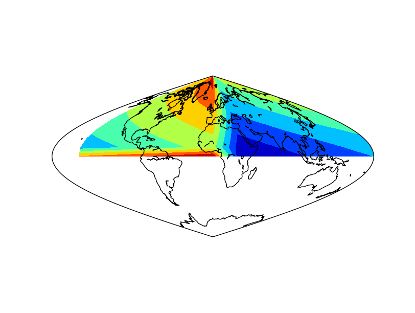

    The result applying the method to the data array 

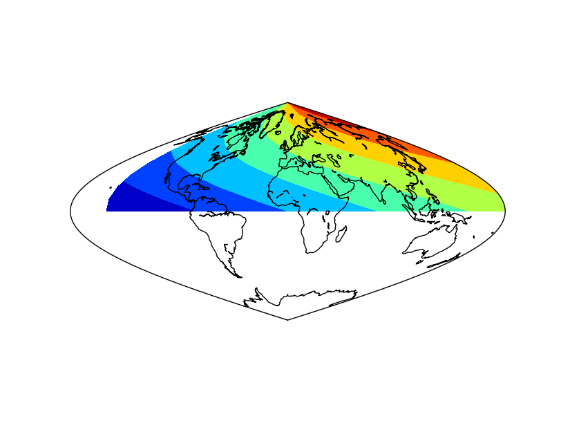

    The result without applying the method to the data array. Not that the blue (value 0) is not at longitude 0

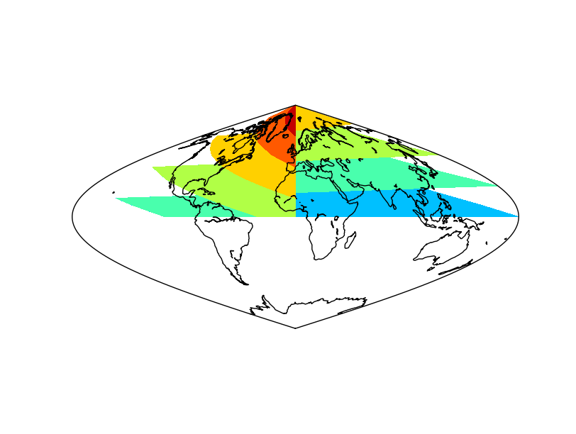

    The result without applying shiftdata. Note that the result is not as expected, since the longitudes are outside the right interval

.. _shiftgrid:

shiftgrid
---------
This function, similar to :ref:`shiftdata`, moves all the longitudes and data east or west.

`basemap.shiftgrid(lon0, datain, lonsin, start=True, cyclic=360.0) <http://matplotlib.org/basemap/api/basemap_api.html#mpl_toolkits.basemap.shiftgrid>`_

* Note that it's not a basemap method, but a separate function
* lon0 The starting or ending longitude for the final grid. The value must be in the interval of the input longitudes, so sometimes must be set as the starting, and others as the ending with the start argument
* datain the input data array, that will be re-ordered according to the longitudes
* lonsin the input longitudes to be shifted. It's a 1D numpy array, but doesn't have to be in a regular interval
* start argument, which is True by default, sets if the lon0 is the longitude of the initial longitude or the final one at the output array
* cyclic sets the longitude value where the longitudes start again to lon0
* The function returns the re-ordered data and the shifted longitudes

..note: The main difference from :ref:`shiftdata`, is that the projection doesn't need to be cylindrical, since it's not a method from the basemap instance, and that the longitudes don't need to have a uniform incerement

.. literalinclude:: ../code_examples/utilities/shiftgrid.py

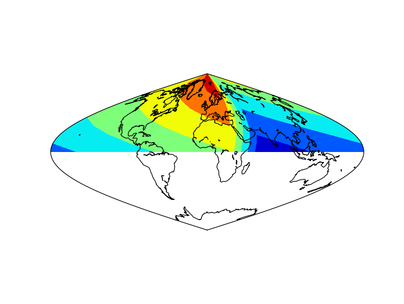

* The coordinates and data arrays are fake data. Coordinates are created with a simple range, and the data array is the sumatory of the x and y positions, so the lower left position will be the one with a lower data value, and the highest, the upper right
    * Note that longitudes start at 30
    * The second element should be 60, but is changed to 70 to show that the interval doesn't have to be regular, not as in :ref:`shiftdata`
* The longitudes and data is shifted using the shiftgrid method
    * The lon0 is set to 180, and the start to False, so the final longitude will be 180, and the ones passing this value, will be passed to -180
    * It's not possible to set lon0 to -180, since is outside the input longitudes interval, so the avobe trick must be used
* The new coordinated are passed to 2d using meshgrid, and re-projected to the map projection using the basemap instance
* The filled contour can be now created

tissot
------
`Tissot's indicatrix <http://en.wikipedia.org/wiki/Tissot%27s_indicatrix>`_, or Tissot's ellipse of distortion is the representation of a circle in a map, showing how the projection distorts it. Usually, many of them are represented to show how the distortion varies with the position.

The function has the following arguments:

`tissot(lon_0, lat_0, radius_deg, npts, ax=None, **kwargs) <http://matplotlib.org/basemap/api/basemap_api.html#mpl_toolkits.basemap.Basemap.tissot>`_

* lon_0 and lat_0 indicate the position of the Tissot's ellipse
* radius_deg indicates the radius of the polygon
* npts Is the number of vertices of the polygon that will be used to approximate the ellipse. A higher npts will make better approached ellipses

.. note:: If the circle gets cut by the edges of the map, i.e. starts at longitude -179 and ends at 179, the method can't handle it properly

.. literalinclude:: ../code_examples/utilities/tissot.py
    :emphasize-lines: 13
    
Tissot's indicatrices for the Orthographic projection:             

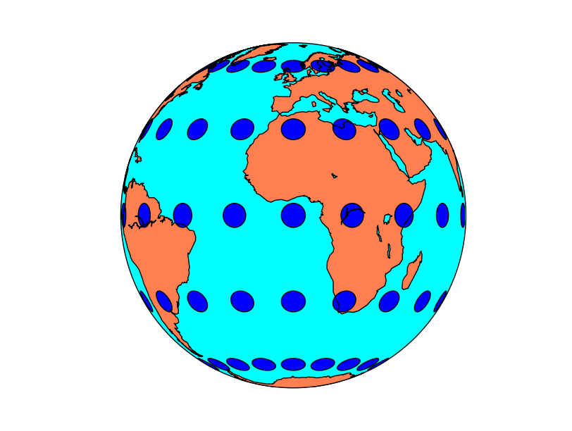
	
Tissot's indicatrices for the Mercator projection:

.. image:: images/utilities/tissot_mercator.png
	
Tissot's indicatrices for the Albers Equal Area projection:

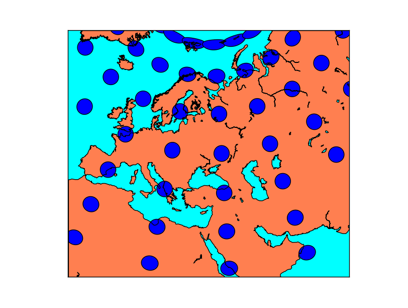

.. _transform_vector:

transform_scalar
----------------
Given a matrix with scalar values in a cylindrical projection, and the longitude and latitude of the points, interpolates the points to a new matrix..

`transform_scalar(datin, lons, lats, nx, ny, returnxy=False, checkbounds=False, order=1, masked=False) <http://matplotlib.org/basemap/api/basemap_api.html#mpl_toolkits.basemap.Basemap.transform_scalar>`_

* datain is a 2d numpy array with the scalar values
* lons, lats are 1D numpy arrays with the positions of the uin an vin matrices, in geographical coordinates. The input lon-lat grid has to be regular (projections cyl, merc, mill, cea and gall)
* nx and ny are the x any y dimensions of the output grid. The output grid covers all the map, not the original points outside its domain. So the final number of points visible on the map will be nx x ny
* returnxy makes the method to return the lons and lats matrices reprojected to the map coordinates. Just as calling the basemap instance
* checkbounds if set to True, the xin and yin values are checked to be in the bounds of xout and yout. If False, and there are values outside the bounds, the output data array values will be clipped to the boundary values
* masked makes the points outside the new grid to be masked if is set to True, or an arbitrary value if given
* order sets the interpolation method:
	* 0 uses the nearest neighbor method
	* 1 uses a bilinear interpolation
	* 3 uses a cubic spline, and requires scipy.ndimage to be installed

.. note:: When the input matrix is not regular in longitude-latitude (i.e. is not a cylindric projection), this method can't be used properly, since the longitude-latitude grid won't be regular. See the :ref:`interp` example for a solution.

.. literalinclude:: ../code_examples/utilities/transform_scalar.py

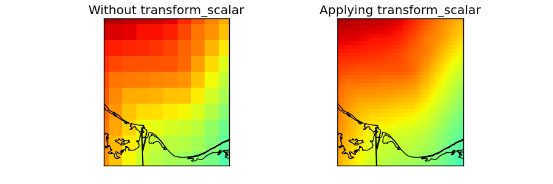

* The data taken for this example is a DEM data for another region and projection, but we'll use fake longitudes and latitudes so it can be used. 
* `numpy linspace <http://docs.scipy.org/doc/numpy/reference/generated/numpy.linspace.html>`_ is used to generate an equal spaced longitudes and latitudes arrays. They have to be 1D to use transform_scalar, so the projection has to be cylindrical (projections cyl, merc, mill, cea and gall)
* The original field is drawn on the first map
	* lons and lats are converted first to 2D arrays using `meshgrid <http://docs.scipy.org/doc/numpy/reference/generated/numpy.meshgrid.html>`_
	* The longitudes and latitudes are converted to the mercator projection using the basemap instance
	* :ref:`pcolormesh` is used to draw the result, taking care to set the maximum and minimum values, so the two maps behave the same way  
* transform_scalar is applied
	* The returnxy argument set to true, so the new grid positions can be get easily
	* The size of the new grid will be 40x40, so the pixels are still visible, but small. A bigger number would make the pixels to be much smaller
* The same ref:`pcolormesh` is used to plot the data. The maximum and minimum values are the same as in the later case. If not, the function would assume only the values in the map region, so the colors would be different

..  note:: Masked doesn't seem to work

.. literalinclude:: ../code_examples/utilities/transform_scalar_globe.py

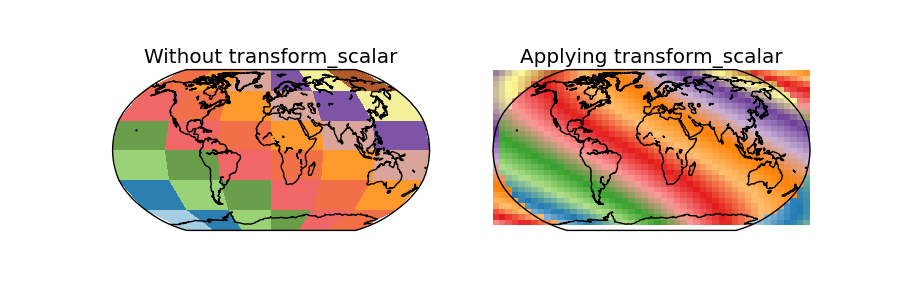

* In this case, the data is the same as the used in the :ref:`shiftdata` example
* Since the map covers the whole world, some of the points in the output grid are outside the world
	* Using masked = True, those points should have no-data values, but this doesn't seem to work, and the points are drawn anyway, creating a very strange effect
	
transform_vector
----------------
Given two matrices of the east-west and north-south components of a vectorial field in a cylindrical projection, and the longitude and latitude of the points, rotates the vectors so they represent the direction properly on the map projection, while interpolates the points to a new matrix..

Some functions, such as barbs, quiver or streamplot, that use vectorial data, asks the vector components to be in the map coordinates i.e. u is from left to right, v from up do down. If the available data is in geographical coordinates i.e. west-east and north-south, these coordinates have to be rotated or the vector direction won't be plot properly. This is the aim of the rotate_vector method.

When drawing barbs, quiver or stream lines, the number of available points may be too low, so interpolating them to a new matrix with more elements can be used to get a plot with a nice number of elements.
 
The method :ref:`rotate_vector` does the same function, but without interpolating the points

`transform_vector(uin, vin, lons, lats, nx, ny, returnxy=False, checkbounds=False, order=1, masked=False) <http://matplotlib.org/basemap/api/basemap_api.html#mpl_toolkits.basemap.Basemap.transform_vector>`_

* uin and vin are the input data matrices. The directions are the geographical, so the u component is west-east and the v component, north-south
* lons, lats are 1D numpy arrays with the positions of the uin an vin matrices, in geographical coordinates. The input lon-lat grid has to be regular (projections cyl, merc, mill, cea and gall)
* nx and ny are the x any y dimensions of the output grid. The output grid covers all the map, not the original points outside its domain. So the final number of points visible on the map will be nx x ny
* returnxy makes the method to return the lons and lats matrices reprojected to the map coordinates. Just as calling the basemap instance
* checkbounds if set to True, the xin and yin values are checked to be in the bounds of xout and yout. If False, and there are values outside the bounds, the output data array values will be clipped to the boundary values
* masked makes the points outside the new grid to be masked if is set to True, or an arbitrary value if given
* order sets the interpolation method:
	* 0 uses the nearest neighbor method
	* 1 uses a bilinear interpolation
	* 3 uses a cubic spline, and requires scipy.ndimage to be installed

.. note:: When the input matrix is not regular in longitude-latitude (i.e. is not a cylindric projection), this method can't be used properly, since the longitude-latitude grid won't be resular. See the :ref:`interp` example for a solution.

.. literalinclude:: ../code_examples/utilities/transform_vector.py

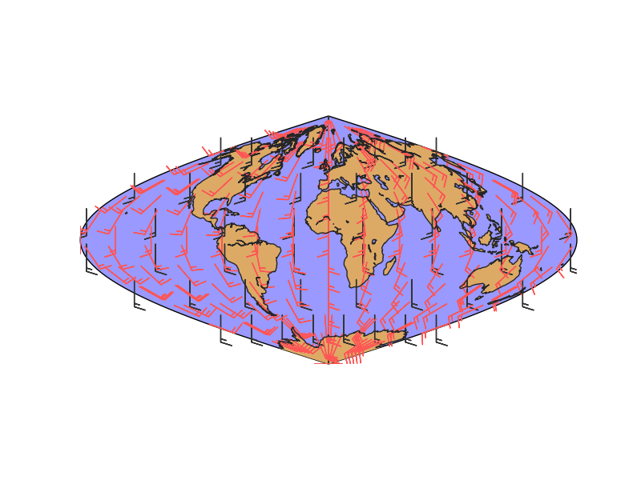

* lons and lats are created in an equal spaced grid covering all the globe, using `linspace <http://docs.scipy.org/doc/numpy/reference/generated/numpy.linspace.html>`_
* v10 and u10 are created so they represent a south to north wind (v10 = 10, u10 = 0). They are transformed to a 2D array using numpy.meshgrid
* Once the data is created, the rotated and interpolated vectors and the new grid are created using transform_vector
	* Setting nx and ny to 15, the new grid will be 15x15 in the map projection, so this is the final number of points visible in the final map
* The original and rotated-interpolated fields are drawn
