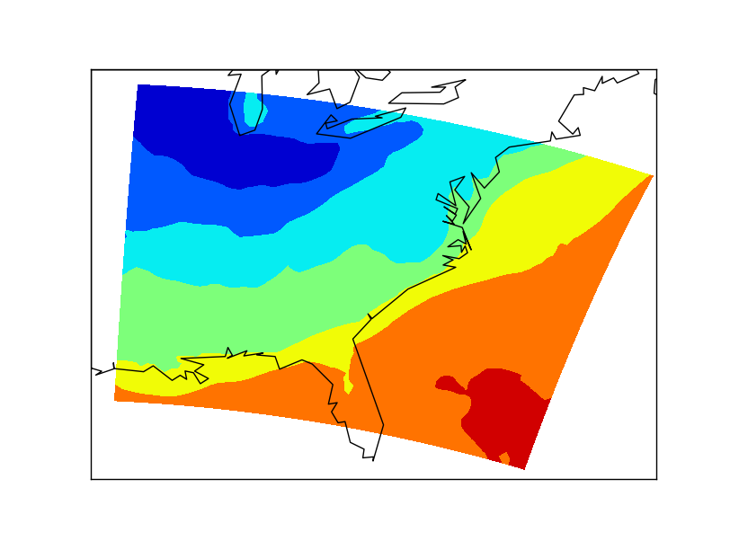
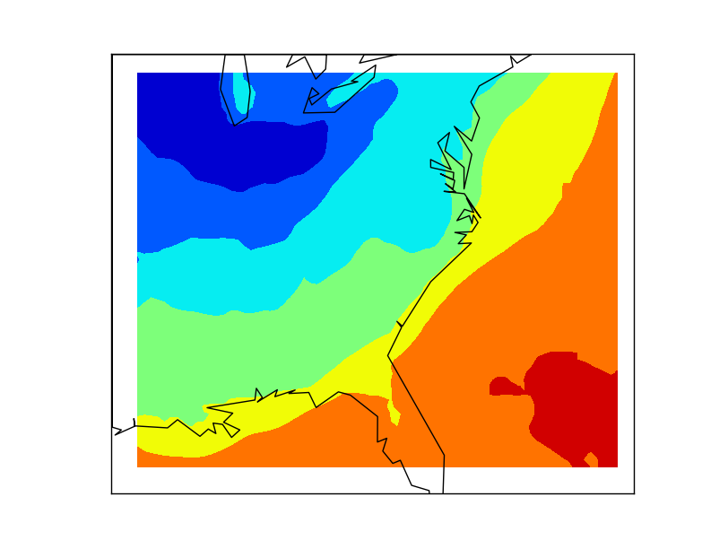
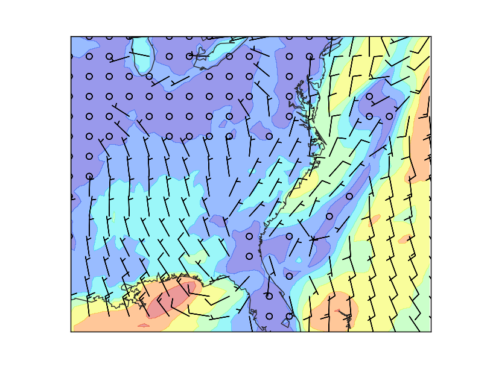

Reading WRF model data
=======================
Basemap is specially good at drawing numerical weather prediction models outputs, such as WRF. `WRF <http://en.wikipedia.org/wiki/Weather_Research_and_Forecasting_Model>`_ is a widely used model, but most of the example can be run with other model outputs, just adapting the variable names.

At the UCAR website is possible to `download a WRF sample output file <http://www.unidata.ucar.edu/software/netcdf/examples/wrfout_v2_Lambert.nc>`_

`The output file descriptor (cdl) <https://www.unidata.ucar.edu/software/netcdf/examples/wrfout_v2_Lambert.cdl>`_ contains all the information about the model size, fields, projection, etc. For instance, we will need the projection information to project the output properly:

	:CEN_LAT = 34.83158f ;
	
	:CEN_LON = -81.02756f ;
	
	:TRUELAT1 = 30.f ;
	
	:TRUELAT2 = 60.f ;
	
.. note:: Make sure that the gdal library installed can read NetCDF files. Check it writing *gdalinfo --formats*
	
Plotting a field as a contour
-----------------------------
.. literalinclude:: ../code_examples/wrf/read_wrf.py

* Note how does GDAL open the files. When dealing with NetCDF files, it uses what it calls *subdatasets*, so every variable acts as an independent file
* XLONG and XLAT contain the information about the longitude and latitude of every point in the matrix. This is very useful using Basemap, since the fields needed for the methods to indicate those positions are already calculated.
* When drawing the contour, the first band from each variable is taken, since in this case, the model has several bands for longitudes, latitudes and temperature
* The strange shape of the data is because the output map is in the default Basemap projection (`Equirectangular <http://en.wikipedia.org/wiki/Equirectangular_projection>`_), but the model is not, so it has to be re-projected.

Projecting the map
------------------
As its name suggests, the model uses a Lambert conformal projection. The metadata file tells us how is this Lambert Conformal projection defined, so plotting the map is easy:

.. literalinclude:: ../code_examples/wrf/read_wrf_projected.py

* The limits in the map don't match those of the data to show that now, the shape of the data is rectangular, so the projection is properly configured

Wind barbs
----------
Basemap has a function that makes drawing wind barbs very simple (unlike using other GIS libraries, btw):

.. literalinclude:: ../code_examples/wrf/read_wrf_barbs.py

* Now, the limits of the map match those of the data, so no white space is shown. The resolution parameter is also changed, to get a prettier coastline.
* Not all the possible barbs are drawn, since the map would be difficult to understand. 
	* To eliminate some of the points, the *numpy.arange* function is used, to select the pixels to be used
	* After having to arrays with the positions, a 2d matrix is created with this values, using *numpy.meshgrid*. Now is possible to select only these points from any array, as shown when using the *barbs* method
* A contour with the wind speed is plotted under the barbs, to make the map more interesting. Note that since the fields are numpy arrays, the module is easily calculated
